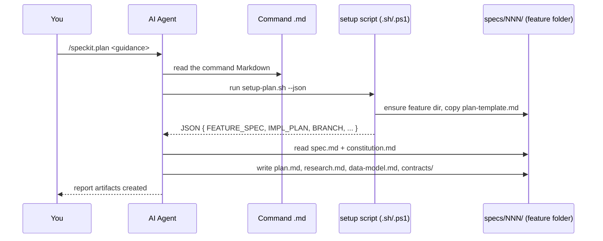
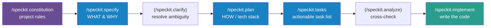
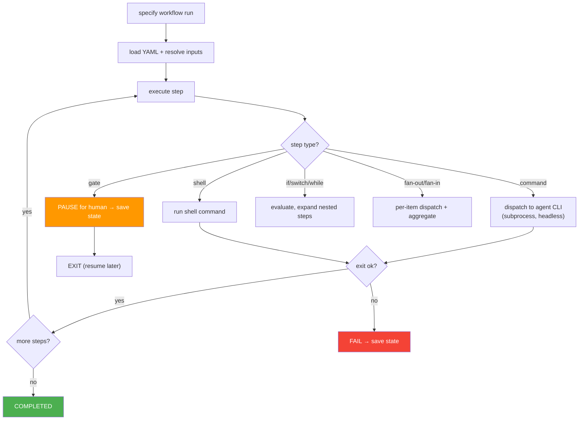
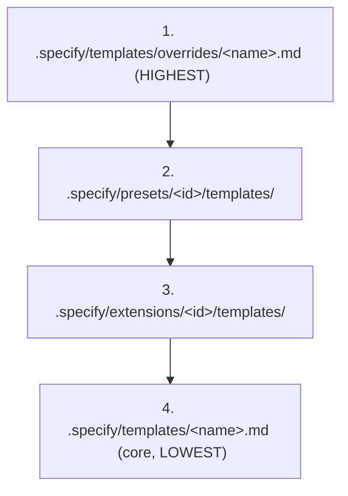

# The Complete Guide to GitHub Spec Kit

> A from-scratch, read-it-front-to-back guide to **GitHub Spec Kit** — the `specify` toolkit for **Spec-Driven Development (SDD)**.
>
> This guide teaches you *how it works*, *what happens at every step*, and *how to bend it to your own purposes*: installing it, understanding `init`, every slash command, every agent and mode, automating the pipeline, adding your own Markdown artifacts, wiring in custom agents, and introducing brand-new steps.
>
> **How this fits with the other docs in this repo.** Two companion files already live here:
> - `SPECKIT-TEAM-GUIDE.md` — a dense, source-accurate engineering reference (great for "where is X defined?").
> - `SPECKIT-AGENT-CONTEXT.md` — a compressed, facts-only reference written for an AI agent's context window.
>
> **This** file is the *tutorial*: it assumes no prior knowledge, explains the *why* behind each mechanism, and walks you through real examples. When you want the terse lookup, jump to the other two.
>
> Based on a source read of `github/spec-kit` (the `specify` CLI, `0.11.x` line). Spec Kit moves fast — always cross-check exact flags with `specify --help` and the version you actually installed.

---

## Table of Contents

**PART I — UNDERSTANDING SPEC KIT**
1. [What problem Spec Kit solves](#1-what-problem-spec-kit-solves)
2. [Spec-Driven Development in one page](#2-spec-driven-development-in-one-page)
3. [The two-layer mental model (read this twice)](#3-the-two-layer-mental-model-read-this-twice)
4. [How the pieces fit: prompts + scripts + filesystem](#4-how-the-pieces-fit-prompts--scripts--filesystem)

**PART II — GETTING STARTED**
5. [Prerequisites](#5-prerequisites)
6. [Installing the `specify` CLI](#6-installing-the-specify-cli)
7. [`specify init` — exactly what happens](#7-specify-init--exactly-what-happens)
8. [Anatomy of a generated project](#8-anatomy-of-a-generated-project)

**PART III — THE WORKFLOW, STEP BY STEP**
9. [The pipeline at a glance](#9-the-pipeline-at-a-glance)
10. [`/speckit.constitution` — the rule book](#10-speckitconstitution--the-rule-book)
11. [`/speckit.specify` — WHAT & WHY](#11-speckitspecify--what--why)
12. [`/speckit.clarify` — de-risk before planning](#12-speckitclarify--de-risk-before-planning)
13. [`/speckit.plan` — HOW (deep dive)](#13-speckitplan--how-deep-dive)
14. [`/speckit.tasks` — the executable task list](#14-speckittasks--the-executable-task-list)
15. [`/speckit.analyze` & `/speckit.checklist` — quality gates](#15-speckitanalyze--speckitchecklist--quality-gates)
16. [`/speckit.implement` — write the code](#16-speckitimplement--write-the-code)
17. [`/speckit.taskstoissues` & `/speckit.converge`](#17-speckittaskstoissues--speckitconverge)
18. [A full worked example (greenfield)](#18-a-full-worked-example-greenfield)

**PART IV — AGENTS & MODES**
19. [Integrations: the 30+ supported agents](#19-integrations-the-30-supported-agents)
20. [Skills mode vs prompt/command mode](#20-skills-mode-vs-promptcommand-mode)
21. [The context file (CLAUDE.md / copilot-instructions.md)](#21-the-context-file-claudemd--copilot-instructionsmd)
22. [Greenfield, brownfield, and creative-exploration modes](#22-greenfield-brownfield-and-creative-exploration-modes)

**PART V — AUTOMATING THE PIPELINE**
23. [Three ways to chain steps](#23-three-ways-to-chain-steps)
24. [Handoffs (auto-advance inside the chat)](#24-handoffs-auto-advance-inside-the-chat)
25. [The Workflow Engine (one command, all steps)](#25-the-workflow-engine-one-command-all-steps)
26. [Headless / CI execution](#26-headless--ci-execution)

**PART VI — EXTENDING SPEC KIT FOR YOUR OWN PURPOSE**
27. [The customization decision tree](#27-the-customization-decision-tree)
28. [Adding & changing Markdown artifacts (templates & overrides)](#28-adding--changing-markdown-artifacts-templates--overrides)
29. [Editing how a step behaves (command bodies)](#29-editing-how-a-step-behaves-command-bodies)
30. [Adding a brand-new command/step](#30-adding-a-brand-new-commandstep)
31. [Adding "custom agents" — what that really means](#31-adding-custom-agents--what-that-really-means)
32. [Hooks: inject steps before/after a phase](#32-hooks-inject-steps-beforeafter-a-phase)
33. [Extensions, presets & bundles](#33-extensions-presets--bundles)
34. [Auto-referencing a file every run](#34-auto-referencing-a-file-every-run)
35. [Worked example: a custom 3-step pipeline](#35-worked-example-a-custom-3-step-pipeline)

**PART VII — OPERATING IT**
36. [Upgrading without losing your work](#36-upgrading-without-losing-your-work)
37. [Distributing customizations across a team](#37-distributing-customizations-across-a-team)
38. [Version control: what to commit](#38-version-control-what-to-commit)
39. [CLI reference & environment variables](#39-cli-reference--environment-variables)
40. [Troubleshooting](#40-troubleshooting)
41. [Glossary](#41-glossary)
42. [Appendix A — copy-paste starter files](#appendix-a--copy-paste-starter-files)
43. [Appendix B — quick command cheat-sheet](#appendix-b--quick-command-cheat-sheet)

---
---

# PART I — UNDERSTANDING SPEC KIT

## 1. What problem Spec Kit solves

When you hand an AI coding agent a one-line prompt like *"build me a photo organizer,"* you get something — but rarely the thing you meant. The agent guesses at scope, invents a tech stack, skips edge cases, and you spend the next hour correcting it. The gap between **what you intended** and **what got built** is the perennial problem of software, and a fast code generator makes that gap *wider*, not narrower, because it produces wrong code faster.

**Spec Kit's bet:** if you force the intent to be written down — precisely, reviewably, in stages — *before* any code is generated, then the code becomes a predictable, almost mechanical translation of an agreed specification. Instead of "prompt → code," you do:

```
principles → specification → plan → tasks → code
```

…where every arrow is a **reviewable Markdown artifact** a human can read, correct, and approve. The specification, not the code, becomes the source of truth. Code is a downstream build product of the spec — and when requirements change, you change the spec and regenerate, rather than reverse-engineering intent out of a diff.

That is **Spec-Driven Development**, and Spec Kit is the toolkit that operationalizes it across 30+ different AI coding agents.

### What Spec Kit is *not*

- It is **not a model or an agent.** It does not contain an LLM. It supplies *disciplined prompts* and *deterministic scripts*; your AI agent (Claude Code, Copilot, Gemini, Cursor, …) is the engine.
- It is **not a framework you import.** There is no library to `pip install` into your app. It scaffolds Markdown + shell files into your repo and gets out of the way.
- It is **not locked to one language or stack.** The templates carry no language assumptions; the `implement` step recognizes dozens of language/tool profiles and applies whichever fits your plan.

---

## 2. Spec-Driven Development in one page

The official `spec-driven.md` frames the philosophy as a **power inversion**:

> *"Code serves specifications"* — instead of specifications being throwaway scaffolding for the "real" artifact (code), the spec is primary and code is the *last-mile implementation*.

The methodology rests on a few ideas worth internalizing:

| Idea | What it means in practice |
|---|---|
| **Executable specifications** | The spec must be precise and complete enough that an agent can build from it. A vague spec produces vague software. |
| **Intent before mechanism** | `specify` captures *what* and *why* with **zero** technology choices. The *how* is deferred to `plan`. Mixing them early is the classic mistake. |
| **Multi-step refinement** | You don't one-shot. You iterate: specify → clarify → plan → tasks, reviewing each artifact. Each step de-risks the next. |
| **A constitution governs everything** | A small set of immutable engineering principles (test-first, simplicity, library-first, etc.) constrains every plan and is enforced at planning time. |
| **Specs evolve** | Brownfield work updates the spec from operational reality, then regenerates — the loop is `0 → 1 → 1' → 2 → 3 → N`, not a one-way street. |

The memorable line from the docs: SDD *"doesn't replace developers — it amplifies their effectiveness,"* shifting your effort from mechanical translation to judgment: writing good specs, reviewing artifacts, and approving gates.

---

## 3. The two-layer mental model (read this twice)

This is the single most important thing to understand, because nearly every "where do I change X?" question hinges on it.

```
┌──────────────────────────────────────────────────────────────┐
│  LAYER 1 — THE TOOL   (the repo github/spec-kit)             │
│  The `specify` CLI (Python) + the MASTER templates/scripts/  │
│  workflows. You edit this layer ONLY if you fork Spec Kit.   │
└──────────────────────────────────────────────────────────────┘
                          │
              `specify init` copies files OUT
                          ▼
┌──────────────────────────────────────────────────────────────┐
│  LAYER 2 — YOUR PROJECT   (e.g. your web app's repo)        │
│  .specify/  +  the agent command files (.claude/skills/ or   │
│  .github/prompts/) + a context file (CLAUDE.md / …).         │
│  THIS is where your customizations live.                     │
└──────────────────────────────────────────────────────────────┘
```

**Implications you will use constantly:**

- When you "customize Spec Kit," you almost always mean **Layer 2** — your project's `.specify/` folder, its constitution, its template overrides, its hooks. You rarely need to touch Layer 1.
- To **replicate a teammate's setup**, you copy their Layer-2 files (`.specify/…` + command files). You almost never need their fork.
- A company's internal "framework built on Spec Kit" is usually either *(a)* a fork of Layer 1, or *(b)* an internal **preset/extension + a custom workflow YAML** layered onto stock Spec Kit. (§37 shows how to tell which.)

**Second core truth:** *Slash commands are not code.* `/speckit.plan` is a Markdown file full of instructions. When you run it, your agent literally **reads that Markdown and follows it.** There is no compiled "plan engine." This is liberating: to change behavior, you edit prose.

---

## 4. How the pieces fit: prompts + scripts + filesystem

Spec Kit splits every step into two kinds of work:

- **Judgment work** (writing a spec, designing a data model) → handled by the **LLM**, driven by a Markdown prompt.
- **Deterministic work** (compute the branch name, create the feature folder, copy a template, find the repo root) → handled by **shell scripts** that emit **JSON** the agent parses.



**The handoff medium between steps is the filesystem, not memory.** Each step reads the previous artifact *from disk* (`specs/NNN-feature/…`) and writes the next one. The "current feature" is tracked by three things working together:

1. the **git branch name** (e.g. `001-photo-albums`),
2. **`.specify/feature.json`** — a pointer file naming the active feature directory,
3. optionally the **`SPECIFY_FEATURE`** environment variable (overrides the pointer).

Internalize this and the whole system stops being mysterious: *commands are prompts, scripts do the bookkeeping, and everything talks through files in `specs/`.*

---
---

# PART II — GETTING STARTED

## 5. Prerequisites

| Requirement | Notes |
|---|---|
| **OS** | Linux, macOS, or Windows. On Windows the scripts run as PowerShell (`.ps1`); elsewhere as Bash (`.sh`). Git Bash/WSL also work. |
| **Python 3.11+** | The `specify` CLI is a Python package. |
| **Git** | Feature state is tracked partly via branch names; most workflows assume a git repo. |
| **`uv`** (recommended) or **`pipx`** | To install/run the CLI cleanly in an isolated environment. |
| **An AI coding agent** | One of 30+: Claude Code, GitHub Copilot, Gemini CLI, Cursor, Codex, Qwen, opencode, etc. Install and **authenticate** it. |
| **Your stack's toolchain** | For `implement` to actually build/run, the language tools your plan picks (`node`/`npm`, `python`, `dotnet`, `go`, …) must be installed locally. |

`uv` is the smoothest path because it can run the CLI ephemerally with `uvx` (no global install) and manages the tool environment for you.

---

## 6. Installing the `specify` CLI

### Option A — persistent install with `uv` (recommended)

```bash
# Install uv first (see https://docs.astral.sh/uv/ for your OS), then:
uv tool install specify-cli --from git+https://github.com/github/spec-kit.git

# Pin a specific release (recommended for teams — reproducible):
uv tool install specify-cli --from git+https://github.com/github/spec-kit.git@v0.11.9
```

Replace the tag with the latest from the [Releases page](https://github.com/github/spec-kit/releases). Pinning a tag means everyone on your team runs the *same* templates and scripts.

### Option B — ephemeral run with `uvx` (no install)

```bash
uvx --from git+https://github.com/github/spec-kit.git specify init my-project --integration claude
```

Great for trying it once or in CI where you don't want a persistent tool.

### Option C — `pipx`

```bash
pipx install "git+https://github.com/github/spec-kit.git"
```

### Verify & self-manage

```bash
specify --help            # confirm it's on PATH; lists command groups
specify self check        # read-only: is a newer version available?
specify self upgrade      # upgrade the CLI (auto-detects uv vs pipx)
specify self upgrade --dry-run          # preview only
specify self upgrade --tag v0.11.9      # pin a version
```

> `specify self upgrade` upgrades **the tool** (Layer 1). It does **not** touch the files already scaffolded into your project — that's a separate operation (§36).

---

## 7. `specify init` — exactly what happens

`specify init` is the moment Layer 1 copies files into Layer 2. Understanding it removes 90% of "why is this file here?" confusion.

### The commands

```bash
# New project in a new folder, using Claude Code:
specify init my-project --integration claude

# Initialize INTO the current directory (two equivalent forms):
specify init --here --integration copilot
specify init .       --integration copilot

# Force into a non-empty directory (merges/overwrites — used for upgrades too):
specify init . --force --integration copilot

# Install commands as agent SKILLS instead of slash-prompts (supported agents):
specify init . --integration claude  --integration-options="--skills"

# Skip the "is your agent CLI installed?" preflight check:
specify init my-project --integration gemini --ignore-agent-tools

# Start from a preset (a bundle of template overrides + config):
specify init my-project --integration claude --preset lean

# Bring-your-own-agent (generic adapter, custom command directory):
specify init . --integration generic --integration-options="--commands-dir .myagent/commands"
```

### What it does, in order

1. **Preflight checks.** Confirms required tools exist (git, the selected agent CLI unless `--ignore-agent-tools`).
2. **Picks an integration + script flavor.** You choose the agent (default is non-interactive `copilot` if unspecified in some modes) and whether to lay down Bash (`sh`) or PowerShell (`ps`) scripts (auto-detected by OS).
3. **Lays down the shared `.specify/` scaffold** — templates, scripts, the bundled workflow, shared infra — and copies `constitution-template.md` → `.specify/memory/constitution.md` (**preserving** an existing constitution if one is already there).
4. **Installs the agent-specific command files** in the location that agent expects, plus the **context file**, plus any `--preset` you asked for.

### Crucial facts about `init`

- **No AI runs during init.** It only writes files. It will not generate a spec or any code.
- **It works fully offline.** The assets are bundled inside the CLI package and are version-matched to the CLI you installed — `init` does not fetch templates from the network.
- **Command *content* is identical across agents.** Only the *packaging and location* differ. The instructions inside `/speckit.plan` are the same whether you're on Claude or Copilot; one becomes `.claude/skills/speckit-plan/SKILL.md`, the other becomes `.github/prompts/speckit.plan.prompt.md`.

### Where commands land, per agent (examples)

| Agent | Commands installed at | Context file |
|---|---|---|
| **Claude Code** | `.claude/skills/speckit-<name>/SKILL.md` | `CLAUDE.md` |
| **GitHub Copilot** (default) | `.github/prompts/speckit.<name>.prompt.md` (+ `.vscode/settings.json`) | `.github/copilot-instructions.md` |
| **Copilot** (`--skills` mode) | `.github/skills/speckit-<name>/SKILL.md` | `.github/copilot-instructions.md` |
| **Gemini / Cursor / Codex / …** | each integration's own folder/format | each integration's own context file |

> **Tip:** after `init`, open the installed command files. They *are* the system. Reading `.claude/skills/speckit-plan/SKILL.md` tells you precisely what `/speckit.plan` will do in your project — including any local edits.

---

## 8. Anatomy of a generated project

A project initialized for Claude Code (Copilot differs only in the command/context locations noted above):

```
my-project/
├── .specify/
│   ├── memory/
│   │   └── constitution.md          # your project rules (§10)
│   ├── templates/
│   │   ├── spec-template.md          # shape of spec.md   (§28)
│   │   ├── plan-template.md          # shape of plan.md
│   │   ├── tasks-template.md         # shape of tasks.md
│   │   ├── constitution-template.md
│   │   └── overrides/               # ← YOUR template overrides (highest priority)
│   ├── scripts/
│   │   ├── bash/                     # *.sh  (Linux/macOS/Git-Bash)
│   │   └── powershell/               # *.ps1 (Windows)
│   ├── extensions/                   # installed extensions
│   ├── presets/                      # installed presets
│   ├── extensions.yml                # hook configuration (§32)
│   └── feature.json                  # "current feature" pointer
│
├── .claude/
│   └── skills/                       # the slash commands, as skills
│       ├── speckit-constitution/SKILL.md
│       ├── speckit-specify/SKILL.md
│       ├── speckit-plan/SKILL.md
│       ├── speckit-tasks/SKILL.md
│       ├── speckit-implement/SKILL.md
│       └── …
├── CLAUDE.md                         # always-loaded agent context (§21)
│
└── specs/                            # ONE folder per feature
    └── 001-photo-albums/
        ├── spec.md
        ├── plan.md
        ├── research.md
        ├── data-model.md
        ├── contracts/                # API/interface contracts
        ├── quickstart.md
        └── tasks.md
```

The folders you'll touch most as a customizer: **`.specify/templates/` (and `overrides/`)**, **`.specify/memory/constitution.md`**, **`.specify/extensions.yml`**, and the installed **command files**.

---
---

# PART III — THE WORKFLOW, STEP BY STEP

## 9. The pipeline at a glance



Steps in parentheses are optional but recommended. Each step **reads the previous artifact and writes the next**, all inside one feature folder:

| Step | Reads | Writes |
|------|-------|--------|
| `constitution` | your principles | `.specify/memory/constitution.md` |
| `specify` | your feature description | `specs/NNN-feature/spec.md` |
| `clarify` | `spec.md` | updates `spec.md` (Q&A resolved) |
| `plan` | `spec.md` + constitution | `plan.md`, `research.md`, `data-model.md`, `contracts/`, `quickstart.md` |
| `tasks` | `plan.md` + design docs | `tasks.md` (with `[P]` parallel markers) |
| `analyze` | spec + plan + tasks | a consistency report (read-only) |
| `checklist` | spec/plan | a custom quality checklist |
| `implement` | `tasks.md` + design docs | **source code**, marks tasks `[X]` |

Every command file is **YAML frontmatter + a Markdown instruction body**. The frontmatter you'll see most:

- `description:` — shown in the agent's command picker.
- `scripts:` — the deterministic helper to run first (`sh` and `ps` variants); returns JSON paths.
- `handoffs:` — suggested next command(s); `send: true` auto-fires the next one (§24).

---

## 10. `/speckit.constitution` — the rule book

**Writes:** `.specify/memory/constitution.md`

The constitution is your project's immutable engineering charter — the principles every plan must respect. Think test policy, architectural constraints, simplicity rules, security/compliance non-negotiables. The classic articles the methodology suggests:

- **Library-first** — features begin as standalone, reusable libraries.
- **Test-first** — tests precede implementation.
- **CLI/observability** — functionality is inspectable.
- **Simplicity** — resist over-engineering; cap complexity.
- **Integration-first testing** — prefer real environments over mocks.

You don't have to use those — they're a starting point. Write the rules *your* org actually enforces.

### How to run it

```
/speckit.constitution Create principles focused on code quality, comprehensive testing
standards, accessibility, and performance budgets. Tests are written before implementation.
Prefer the standard library; any new third-party dependency must be justified in the plan.
```

### Why it matters downstream

`/speckit.plan` **reads the constitution** and performs a **"Constitution Check"** gate: if the plan would violate a principle without explicit justification, the plan step is instructed to **error** and surface it. This is the mechanism that makes org rules *stick* instead of being aspirational. If your team "added rules to Spec Kit," the constitution is the **first place to look.**

> **Pro move:** keep the constitution short and genuinely enforceable. Ten crisp, checkable principles beat fifty vague aspirations the agent can't verify.

---

## 11. `/speckit.specify` — WHAT & WHY

**Writes:** `specs/NNN-feature/spec.md` (and creates the feature folder + branch)

This is where you describe the feature in **product terms** — user stories, requirements, acceptance criteria — and deliberately **avoid technology**. No frameworks, no databases, no file names. Just what the user can do and why.

### How to run it

```
/speckit.specify Build an application that helps me organize photos into albums.
Albums are grouped by date and can be reordered by drag-and-drop on the main page.
Albums are never nested inside other albums. Within an album, photos appear in a
tile grid. A user can create, rename, and delete albums, and move photos between them.
```

### What happens under the hood

The command's setup script (`create-new-feature.sh`/`.ps1`) does the deterministic bookkeeping:

1. Computes a feature slug and number (e.g. `001-photo-albums`).
2. Creates `specs/001-photo-albums/` and (typically) a matching git branch.
3. Copies `spec-template.md` into the folder as `spec.md`.
4. Writes `.specify/feature.json` so every later step knows this is the active feature.

Then the LLM fills `spec.md` against the template: user stories, functional requirements, a **Review & Acceptance Checklist**, and explicit **`[NEEDS CLARIFICATION]`** markers wherever you were vague. Those markers are not noise — they are the raw material for the next step.

> **Anti-pattern:** sneaking tech into the spec ("store in PostgreSQL with a React frontend"). Resist it. Tech belongs in `plan`. Keeping `specify` pure is what lets you later explore *different* stacks against the *same* spec.

---

## 12. `/speckit.clarify` — de-risk before planning

**Reads/updates:** `spec.md`

Optional but highly recommended. `clarify` scans the spec for ambiguity and under-specification (including those `[NEEDS CLARIFICATION]` markers) and asks you **targeted questions** — then folds your answers back into the spec.

### How to run it

```
/speckit.clarify
```

Answer the questions it poses. It's the cheapest moment in the whole pipeline to fix a misunderstanding: a wrong assumption caught here costs one sentence; caught in `implement`, it costs a rewrite.

> **When to skip:** for a tiny, unambiguous change you can go straight to `plan`. For anything with real surface area, run `clarify` — it pays for itself.

---

## 13. `/speckit.plan` — HOW (deep dive)

**Reads:** `spec.md` + `.specify/memory/constitution.md`
**Writes:** `plan.md`, `research.md`, `data-model.md`, `contracts/`, `quickstart.md`

This is the richest step and worth understanding in detail, because its structure is the template for any custom step you'll later build. Here is its real shape (frontmatter abbreviated):

```yaml
---
description: Execute the implementation planning workflow using the plan
  template to generate design artifacts.
handoffs:
  - label: Create Tasks
    agent: speckit.tasks
    prompt: Break the plan into tasks
    send: true                      # auto-advance to tasks
  - label: Create Checklist
    agent: speckit.checklist
    prompt: Create a checklist for the following domain...
scripts:
  sh: scripts/bash/setup-plan.sh --json
  ps: scripts/powershell/setup-plan.ps1 -Json
---
```

The body runs in phases:

**Pre-execution.** Reads `.specify/extensions.yml` and loads any `before_plan` hooks (§32). Mandatory hooks execute and block; optional ones are surfaced as suggestions.

**Main workflow (this is where you give guidance — the tech stack):**

```
/speckit.plan Use Vite with minimal libraries — vanilla HTML, CSS, and JavaScript
where possible. Images are never uploaded; metadata lives in a local SQLite database.
Target modern evergreen browsers. No build step beyond Vite.
```

1. **Setup** — runs `setup-plan.sh --json`, parses JSON for the paths (`FEATURE_SPEC`, `IMPL_PLAN`, `SPECS_DIR`, `BRANCH`, …).
2. **Load context** — reads the feature `spec.md` and the **constitution**.
3. **Execute the plan template** — fills Technical Context, runs the **Constitution Check** gate, and produces the design artifacts.
4. **Update the agent context file** — records a reference to the new plan.

**Phase 0 — Research (`research.md`).** Extracts every `NEEDS CLARIFICATION` unknown and every technology/dependency decision, *spawns research tasks* to resolve them, and consolidates findings. (This is the **only** stock command that tells the LLM it *may* dispatch parallel research sub-tasks — see §31 on "subagents." The number is dynamic: roughly *(# unknowns) + (# tech choices)*.)

**Phase 1 — Design.** Generates:
- `data-model.md` — entities and relationships derived from the spec.
- `contracts/` — API/interface contracts.
- `quickstart.md` — a validation guide ("how do I know it works?").

**Post-execution.** Runs any `after_plan` hooks.

> **The Constitution Check is the heart of `plan`.** It's where "we don't allow X" becomes a hard stop rather than a hope. If you want org rules enforced, put them in the constitution and let this gate do the work.

---

## 14. `/speckit.tasks` — the executable task list

**Reads:** `plan.md` + the design docs
**Writes:** `tasks.md`

`tasks` converts the plan into an **ordered, dependency-aware checklist**, usually grouped by user story, with each task concrete enough to execute. Two markers matter:

- **`[P]`** — this task *may* run in parallel with its siblings (no ordering dependency). It's metadata; whether your agent actually parallelizes is up to the agent.
- **`[X]`** — marked by `implement` as tasks complete (so the run is resumable and auditable).

A typical `tasks.md` fragment:

```markdown
## User Story: Create and reorder albums

- [ ] T01 Scaffold Vite project structure
- [ ] T02 [P] Define SQLite schema for albums and photos (from data-model.md)
- [ ] T03 [P] Implement album CRUD module
- [ ] T04 Implement drag-and-drop reorder on the main page
- [ ] T05 Independent Test: create 3 albums, reorder, reload — order persists
```

Notice the **Independent Test** lines — the tasks template bakes verification into the work itself. The final phase of a generated `tasks.md` is usually a "Polish & Cross-Cutting Concerns" pass (perf, a11y, error handling).

### How to run it

```
/speckit.tasks
```

No arguments needed — it reads the plan. You can pass guidance to bias granularity (e.g. *"keep tasks small enough to review in one sitting"*).

---

## 15. `/speckit.analyze` & `/speckit.checklist` — quality gates

These two are **optional, read-mostly** checks you run between `tasks` and `implement`.

### `/speckit.analyze`

**Reads:** spec + plan + tasks → **Writes:** a consistency report (it does *not* change code).

It cross-checks the three artifacts for drift and gaps: Does every requirement in the spec have a task? Does the plan contradict the spec? Are there orphan tasks with no backing requirement? Run it to catch incoherence before you spend tokens building the wrong thing.

```
/speckit.analyze
```

### `/speckit.checklist`

**Generates** a custom, domain-specific quality checklist that validates the requirements (security, accessibility, performance, data-privacy — whatever you scope it to).

```
/speckit.checklist Create a checklist covering accessibility (WCAG AA), keyboard
navigation, and offline behavior.
```

> Think of `analyze` as *"is the plan internally consistent?"* and `checklist` as *"have we considered the things that matter in this domain?"*

---

## 16. `/speckit.implement` — write the code

**Reads:** `tasks.md` + the design docs → **Writes:** source code; marks tasks `[X]`

This is where code finally appears. The agent walks `tasks.md` in dependency order, honoring `[P]` for parallelizable work, writing real files, and ticking off tasks as it goes. The `implement` command carries dozens of **language/tool profiles**, so it adapts to whatever stack your plan chose — it knows how a Node project differs from a .NET or Go one.

### How to run it

```
/speckit.implement
```

### Before you run it

- Make sure the toolchain your plan picked is installed (`node`, `python`, `dotnet`, …). `implement` will try to build/test, and missing tools cause avoidable failures.
- Commit your spec/plan/tasks first, so the code diff is cleanly separable from the planning artifacts.

### What it does at the end

`implement` includes a **completion-validation** step — it checks that tasks are actually done and the result is coherent (often running the project's tests/quickstart). This, plus the per-story Independent Tests in `tasks.md`, is Spec Kit's built-in verification story. (There is no single `verify` command; §32 and `SPECKIT-TEAM-GUIDE.md §18` show how to add an explicit regression gate.)

---

## 17. `/speckit.taskstoissues` & `/speckit.converge`

### `/speckit.taskstoissues`

Pushes your `tasks.md` into **GitHub issues** for tracking — useful when humans will pick up some tasks, or you want the task list visible in your project board.

```
/speckit.taskstoissues
```

### `/speckit.converge` — the brownfield workhorse

**Reads** the current codebase **and** spec/plan/tasks; **appends only the unbuilt work.**

This is what makes Spec Kit usable on an *existing* codebase instead of only greenfield. `converge` assesses what already exists against the spec, figures out what's actually missing, and reconciles the drift — rather than blindly regenerating everything. It's how you retrofit SDD onto legacy code without a rewrite.

```
/speckit.converge
```

---

## 18. A full worked example (greenfield)

Here's the entire flow for the photo-album app, end to end, on Claude Code.

```bash
# 0. Install + scaffold
uv tool install specify-cli --from git+https://github.com/github/spec-kit.git
specify init photo-albums --integration claude
cd photo-albums
git init && git add -A && git commit -m "scaffold spec-kit"

# 1. Launch your agent (Claude Code) in this directory, then in the chat:
```

```
/speckit.constitution Principles: test-first; prefer the standard library and vanilla
web platform; accessibility is non-negotiable (keyboard + screen-reader); no data leaves
the device; keep modules small and independently testable.
```

```
/speckit.specify Build a photo organizer. Users create albums grouped by date and reorder
them via drag-and-drop on the main page. Albums are never nested. Inside an album, photos
show in a tile grid. Users can create, rename, delete albums, and move photos between them.
```

```
/speckit.clarify
```
*(answer its questions — e.g. "what happens to photos when an album is deleted?")*

```
/speckit.plan Vite + vanilla HTML/CSS/JS, minimal libraries. Metadata in a local SQLite
database via better-sqlite3. No uploads; images read from a chosen local folder. Modern
browsers only.
```

```
/speckit.analyze
```
*(read the consistency report; fix the spec/plan if it flags gaps)*

```
/speckit.tasks
```

```
/speckit.implement
```

After `implement`, you have a working app, a `tasks.md` with everything ticked `[X]`, and a complete paper trail in `specs/001-photo-albums/`. If a reviewer asks "why SQLite?", the answer is in `research.md`. If requirements change, you edit the spec and re-run from `plan` — not reverse-engineer the code.

---
---

# PART IV — AGENTS & MODES

## 19. Integrations: the 30+ supported agents

An **integration** is an adapter for one AI coding agent. Each lives in its own folder in Layer 1 (`src/specify_cli/integrations/<agent>/`) and knows, for that agent:

- **where** to install commands (e.g. `.claude/skills`, `.github/prompts`),
- the **format** (Markdown, TOML, …),
- the **arguments placeholder** (e.g. `$ARGUMENTS`),
- the **context file** name (`CLAUDE.md`, `.github/copilot-instructions.md`, …),
- **`dispatch_command()`** — how to invoke that agent **non-interactively** as a subprocess (this is what powers the workflow engine and CI — §25–26).

The full roster (subject to change as the project grows) includes:

```
agy  amp  auggie  bob  claude  cline  codebuddy  codex  copilot
cursor_agent  devin  firebender  forge  gemini  generic  goose
hermes  iflow  junie  kilocode  kimi  kiro_cli  lingma  omp
opencode  pi  qodercli  qwen  roo  rovodev  shai  tabnine
trae  vibe  windsurf  zcode  zed
```

List what your installed CLI actually supports:

```bash
specify integration list
```

Pick one at init time. You can also use **different agents for different steps** in a workflow (§25), and the **`generic`** integration lets you wire up an agent Spec Kit doesn't know about by pointing it at a custom commands directory.

---

## 20. Skills mode vs prompt/command mode

Some agents (Claude Code, and Copilot via `--skills`) support **skills** — self-contained command folders (`speckit-plan/SKILL.md`) the agent discovers automatically. Others use a flatter **prompt/command** layout (Copilot's default `.github/prompts/speckit.plan.prompt.md`).

```bash
# Skills mode (where supported):
specify init . --integration claude  --integration-options="--skills"
specify init . --integration copilot --integration-options="--skills"
```

The **content is the same**; the difference is discovery and packaging. If your agent supports skills, they're usually the nicer experience (auto-discovered, namespaced). If a command "isn't found," the usual cause is an agent/mode mismatch — see §40.

---

## 21. The context file (CLAUDE.md / copilot-instructions.md)

Every integration designates a **context file** that the agent loads **on every turn**, no matter which command you run:

| Agent | Context file |
|---|---|
| Claude Code | `CLAUDE.md` |
| GitHub Copilot | `.github/copilot-instructions.md` |
| Gemini / others | their own equivalents |

This is the place for **always-true** facts about your repo: coding conventions, the location of architecture docs, "always run `make lint` before finishing," directory layout, domain glossary. `plan` even updates this file with a reference to the current plan so the agent stays oriented.

> Use the context file for *ambient* knowledge ("how we do things here") and the **constitution** for *enforceable rules* (checked at plan time). They overlap, but the constitution is a gate; the context file is background.

---

## 22. Greenfield, brownfield, and creative-exploration modes

Spec Kit supports three working modes — these aren't flags, they're *ways of using the same pipeline*:

| Mode | What it is | How you do it |
|---|---|---|
| **Greenfield (0→1)** | Build something new from scratch. | The full `specify → … → implement` flow (§18). |
| **Creative exploration (1′)** | Try multiple stacks/designs against the *same* spec. | Keep `spec.md` fixed; run `plan` several times with different tech guidance on separate branches, then compare. This is *why* `specify` must stay tech-free. |
| **Brownfield (iterate)** | Add features to / modernize an existing codebase. | Use **`/speckit.converge`** to assess current code vs spec and append only the missing work; add a regression gate (§32) so new features don't break old ones. |

The same prompts-and-files machinery serves all three; the difference is which commands you lean on and whether the code already exists.

---
---

# PART V — AUTOMATING THE PIPELINE

## 23. Three ways to chain steps

By default you type each command yourself, reviewing artifacts between steps — and for important work, **that manual review is the point.** But you can automate when you want to:

| Mechanism | Where it runs | Best for |
|---|---|---|
| **Manual** | You type each `/speckit.*` | High-stakes work; maximal review. |
| **Handoffs** (`send: true`) | Inside the chat, auto-advancing | Light automation in a single chat session. |
| **Workflow engine** (`specify workflow run`) | Terminal, headless subprocesses | One command runs many steps; CI; per-step agent/model control. |

The next three sections cover the two automated paths.

---

## 24. Handoffs (auto-advance inside the chat)

Stock commands already suggest — and can auto-fire — the next command, via the `handoffs:` frontmatter key:

```yaml
handoffs:
  - label: Create Tasks
    agent: speckit.tasks
    prompt: Break the plan into tasks
    send: true        # ← auto-fire the next command in the same chat
```

With `send: true`, finishing `/speckit.specify` can cascade through `plan → tasks → implement` on its own, **inside the chat panel**. To a bystander it looks like "I typed one command and it built everything."

**Caveats:**
- Not every agent honors handoffs (some strip the key). Copilot support depends on its mode.
- `send: false` (or just `label`/`prompt`) shows a **button** instead of auto-firing — a gentler nudge.

To **disable** auto-advance for a step, edit that command's installed file and remove `send: true` (or the whole `handoffs:` block).

---

## 25. The Workflow Engine (one command, all steps)

The engine is how you run the *entire* pipeline from the terminal — and it's almost certainly what any internal "one-command pipeline" is built on.

### A workflow is a YAML file

The bundled one (`workflows/speckit/workflow.yml`) reads roughly:

```yaml
workflow:
  id: speckit
  name: "Full SDD Cycle"
steps:
  - id: specify
    command: speckit.specify
    integration: "{{ inputs.integration }}"
    input: { args: "{{ inputs.spec }}" }
  - id: review-spec
    type: gate                  # ← PAUSE for human approval
    options: [approve, reject]
    on_reject: abort
  - id: plan
    command: speckit.plan
  - id: review-plan
    type: gate
  - id: tasks
    command: speckit.tasks
  - id: implement
    command: speckit.implement
```

### Running it

```bash
specify workflow add speckit
specify workflow run speckit --input spec="Build an OAuth login system"
specify workflow status                 # inspect progress / run ids
specify workflow resume <run_id>        # continue after a gate pause
```

### How it executes

The engine loads the YAML and runs steps **sequentially**, persisting state after each (so it's resumable). For a `command` step it calls the integration's `dispatch_command()`, which **spawns the agent CLI as a non-interactive subprocess** — one slash command at a time.



### The 11 step types

| Type | Purpose |
|---|---|
| `command` | Invoke an installed Spec Kit command via the agent CLI |
| `prompt` | Send an arbitrary inline prompt to the agent |
| `shell` | Run a shell command, capture output |
| `init` | Bootstrap a project (`specify init`) |
| `gate` | Human review/approval (pauses; resumable) |
| `if` | Conditional then/else |
| `switch` | Multi-branch on an expression |
| `while` / `do-while` | Loops |
| `fan-out` / `fan-in` | Dispatch per item over a collection, then aggregate |

### Two facts that will save you hours

1. **Per-step agent & model.** Each step may set its own `integration:` and `model:`. So you can run `specify` on a cheap fast model and `implement` on your most capable one — or route steps to entirely different agents/teams.
2. **Steps do NOT pass file *contents* through `{{ }}` variables.** A `command` step's captured output is only `exit_code` / `stdout` / `stderr` (and stdout is empty while the agent streams). **The real handoff medium is the filesystem** — `specs/NNN/` + `.specify/feature.json`. *Design every step to read the previous artifact from disk*, never via a workflow variable.

Expressions you can use in YAML: `{{ inputs.x }}`, `{{ steps.id.output.exit_code }}`, comparisons, `and`/`or`/`not`, `in`, and filters like `default`, `join`, `contains`.

---

## 26. Headless / CI execution

Because the engine dispatches each command as a non-interactive subprocess, the whole pipeline can run unattended:

- **Install + authenticate the agent CLI** on the runner (the agent is the engine; no auth = no run).
- Set **`SPECIFY_INIT_DIR`** to the project root for non-interactive init.
- Keep **`SPECKIT_COPILOT_ALLOW_ALL_TOOLS=1`** (its default) so Copilot doesn't block on per-tool permission prompts in headless mode.
- **`gate` steps pause for a human.** For fully unattended runs, remove the gates (or pre-decide them); state persists, so a human can `specify workflow resume <run_id>` later.
- Inspect with `specify workflow status`; `SPECKIT_WORKFLOW_RUN_ID` identifies the current run.

> CI tip: run the SDD pipeline to produce/refresh artifacts, but keep a human `gate` (or a required PR review) before `implement` merges — let the machine do the typing and the human keep the judgment.

---
---

# PART VI — EXTENDING SPEC KIT FOR YOUR OWN PURPOSE

This is the part you asked most about. The golden rule: **never edit Layer-1 core files in place. Customize through the seams** — overrides, constitution, hooks, presets, extensions, workflows — so upgrades don't clobber your work.

## 27. The customization decision tree

| I want to… | Change this | Upgrade-safe? |
|---|---|---|
| Change a step's **output structure** | `.specify/templates/overrides/<name>.md` | ✅ (override beats core) |
| Change a step's **behavior/instructions** | the installed command file (`.claude/skills/speckit-*/SKILL.md` or `.github/prompts/*.prompt.md`) | ⚠️ re-init may overwrite — package it instead (§30/§33) |
| Add **org-wide rules** | `.specify/memory/constitution.md` | ✅ (preserved on re-init) |
| **Inject a step** before/after a phase | `.specify/extensions.yml` hooks | ✅ |
| **Attach reference docs** to a step | a `docs/…` folder referenced in the command, or the constitution, or the context file | ✅ |
| **Auto-run all steps** | a workflow YAML + `specify workflow run` | ✅ |
| Use a **different agent/model per step** | `integration:` / `model:` on each workflow step | ✅ |
| Add **defined multi-agent** behavior | explicit prose in a command, or a `fan-out` step | ✅ |
| **Add a brand-new command** | an extension, or a new command file | ✅ via extension |
| **Standardize across many repos** | a preset / extension / bundle / private catalog | ✅ |

---

## 28. Adding & changing Markdown artifacts (templates & overrides)

The **structure of every output document** is controlled by a template. In your project they live at `.specify/templates/`:

- `spec-template.md` → shape of `spec.md`
- `plan-template.md` → shape of `plan.md`
- `tasks-template.md` → shape of `tasks.md`
- `constitution-template.md`

**Editing templates is the single most common customization** — it's how you make every spec/plan/tasks in your project look the way your org wants.

### Do it the upgrade-safe way: overrides

Don't edit `.specify/templates/<name>.md` directly (a re-init can overwrite it). Instead drop a file in **`.specify/templates/overrides/`**. The resolver (`resolve_template`) searches in priority order, first match wins:



So to add, say, a mandatory **"Impact Analysis"** section to every plan:

```bash
mkdir -p .specify/templates/overrides
cp .specify/templates/plan-template.md .specify/templates/overrides/plan-template.md
# edit the override; add your section. It now wins over core.
```

```markdown
## Impact Analysis
List every existing module, API, and data store this feature touches, and how.
Flag any backward-incompatible change and justify it against the constitution.
```

### Adding a *new kind* of artifact (a new Markdown document)

Suppose you want every feature to also produce an `analysis.md`. Two parts:

1. **Create a template** `.specify/templates/analysis-template.md` describing its sections.
2. **Have a step write it** — either reference it from an existing command's body, or (cleaner) create a new command that produces it (§30). Make the step's setup script copy the template into the feature folder, mirroring how `create-new-feature.sh` copies `spec-template.md`.

Because all steps share the feature folder, your new `analysis.md` sits alongside `spec.md` and any later step can read it from disk.

---

## 29. Editing how a step behaves (command bodies)

To change *what a step does* (not just its output shape), edit the command's **installed Markdown** — its prose *is* the behavior:

- Claude: `.claude/skills/speckit-<name>/SKILL.md`
- Copilot: `.github/prompts/speckit.<name>.prompt.md`

For example, to force `plan` to always read your architecture docs, add a line to its body:

```markdown
3.5 Read ALL files under `docs/architecture/` and treat them as authoritative
    technical constraints when filling Technical Context.
```

**Caveat:** these installed files can be overwritten by `specify init --force` (an upgrade). If the change is meant to be permanent and shared, package it as an **extension** (§33) or keep it in a **preset**, rather than hand-editing the installed file. For a quick local tweak, editing in place is fine — just know an upgrade may revert it.

---

## 30. Adding a brand-new command/step

Beyond overriding existing commands, you can add **entirely new ones** (e.g. `myteam.gather`, `myteam.securityreview`). A command file is just **frontmatter + a body that uses `$ARGUMENTS`.**

### Minimal command file

```markdown
---
description: Gather existing code + PO requirements into analysis.md
scripts:
  sh: scripts/bash/setup-analysis.sh --json
  ps: scripts/powershell/setup-analysis.ps1 -Json
handoffs:
  - label: Author Spec
    agent: speckit.specify
    send: false
---
## User Input
```text
$ARGUMENTS
```
## Outline
1. Run {SCRIPT}; parse JSON for FEATURE_DIR and ANALYSIS_FILE.
2. Read the existing codebase areas named in $ARGUMENTS and all files under
   `docs/product/`. 
3. Write ANALYSIS_FILE following `.specify/templates/analysis-template.md`:
   business logic found, gaps, and the requirements to satisfy.
4. Stop. Do not write code.
```

### Two ways to install it

1. **Via an extension (clean, packaged, shareable).** Declare it in the extension's `extension.yml` under `provides.commands:` (name, file, description) and ship the command Markdown inside the extension. `specify extension add <id>` drops it into the agent's command folder on every repo that installs it. This survives upgrades and distributes to the whole team. *(Preferred for anything real.)*
2. **Manually.** Drop the installed file directly (`.claude/skills/myteam-gather/SKILL.md` or `.github/prompts/myteam.gather.prompt.md`). Quick for experimenting; not upgrade-safe.

Keep a consistent prefix (`speckit.`/`myteam.`) so your commands group together in the picker. To make it part of the automated pipeline, add a `command:` step for it in your workflow YAML (§35).

---

## 31. Adding "custom agents" — what that really means

People mean three different things by "add a custom agent." Be precise about which you want, because the mechanism differs:

### (a) "Use an AI tool Spec Kit doesn't natively support"

That's adding an **integration**. The supported path is the **`generic`** adapter:

```bash
specify init . --integration generic --integration-options="--commands-dir .myagent/commands"
```

For first-class support you'd add an integration folder in a Layer-1 fork (defining install paths, format, context file, and `dispatch_command()`), but `generic` covers most "bring your own agent" needs without forking.

### (b) "Run different agents/models on different steps"

That's the **workflow engine** (§25). Set `integration:` and `model:` per step:

```yaml
  - id: specify
    command: speckit.specify
    integration: gemini            # cheap/fast for drafting
  - id: implement
    command: speckit.implement
    integration: claude
    model: claude-opus-4-8         # most capable for code
```

### (c) "Defined, countable sub-agents inside a step" (the common misconception)

Many assume each command has a fixed roster of sub-agents. **It does not.** Commands are prompts; there is no agent roster or count anywhere in Spec Kit. What actually exists:

| What you see | What it really is | A sub-agent? |
|---|---|---|
| `handoffs:` / `agent: speckit.tasks` | the **next command** to chain to | ❌ |
| `[P]` markers in tasks/implement | tasks that *may* run concurrently (metadata) | ❌ |
| "dispatch research agents" in `plan.md` | prose telling the LLM it *may* spin up research tasks | ⚠️ the only real one; count is dynamic |

Only `plan` contains a dispatch instruction, and its count is emergent (≈ unknowns + tech choices), decided at runtime. Whether those become *real* parallel agents depends entirely on your AI tool, not Spec Kit.

**To get defined, countable agents, you add them yourself**, two ways:
1. **Explicit prose** in a command body: *"Spawn one reviewer agent per file changed; each returns findings; aggregate them into review.md."*
2. **A `fan-out` workflow step** over a collection — the agent count equals the collection size, deterministically — followed by `fan-in` to aggregate.

```yaml
  - id: review-each-module
    type: fan-out
    over: "{{ inputs.modules }}"          # one dispatch per module
    command: myteam.review
    input: { args: "Review module {{ item }}" }
  - id: aggregate
    type: fan-in
    command: myteam.aggregate-reviews
```

> Bottom line: "custom agents" = *(a)* a new integration, *(b)* per-step routing in a workflow, or *(c)* explicit fan-out/prose. There is no hidden agent config to flip.

---

## 32. Hooks: inject steps before/after a phase

Hooks let you run something **before or after** any phase **without editing the core command file.** They're configured per-project in **`.specify/extensions.yml`**, and every core command checks this file for its own phase keys (`before_plan`, `after_implement`, …).

```yaml
hooks:
  before_implement:
    - id: pre_test
      enabled: true
      optional: false          # MANDATORY → auto-runs and blocks until done
      extension: "test-extension"
      command: "pre_implement_test"
      description: "Run tests before implementing"
  after_tasks:
    - id: post_test
      optional: true           # OPTIONAL → offered to the user, not forced
      prompt: "Run the post-tasks test?"
```

- **`optional: false`** → a blocking gate: the command runs the hook and waits.
- **`optional: true`** → surfaced as a suggestion the user can trigger.

This is the clean way to add **lint gates, ticket creation, compliance checks, or a regression suite** that applies automatically to every feature and survives upgrades.

### Worked mini-example: a mandatory regression gate

Combine a hook with a template override (full version in `SPECKIT-TEAM-GUIDE.md §18`):

```yaml
# .specify/extensions.yml
hooks:
  after_implement:
    - id: regression_gate
      enabled: true
      optional: false
      extension: "regression"
      command: "run_regression_suite"
      description: "Run existing test suite + smoke tests; fail on regression"
```

Now every feature, after `implement`, must pass your real test suite before it's considered done — no one can forget to run it.

---

## 33. Extensions, presets & bundles

Three packaging mechanisms, increasing in scope:

| Mechanism | Adds | Install | Use for |
|---|---|---|---|
| **Extension** | new **commands + lifecycle hooks** (and templates) | `specify extension add <id>` | reusable *behavior* — a Jira integration, a review command, a packaged regression gate |
| **Preset** | **template overrides + config** (no new capability) | `specify preset add <id>` | reusable *structure* — a compliance-flavored spec, domain terminology, org spec/plan shape |
| **Bundle** | a curated **set of extensions + presets**, versioned | `specify bundle install <id>` | role-based provisioning — "Security Researcher kit," "PM kit," "Developer kit" |

Common commands:

```bash
specify extension search          # discover
specify extension add <id>        # install
specify extension list            # what's installed
specify extension enable|disable|update <id>

specify preset search
specify preset add <id>
specify preset list
specify preset set-priority <id> <n>   # presets stack by priority

specify bundle search [query]
specify bundle info <id>          # see components before installing
specify bundle install <id>
specify bundle list | update | remove
specify bundle validate --path ./my-bundle   # author your own
specify bundle build    --path ./my-bundle
```

**When to use which:** add a *capability* → extension. Reshape *output structure* → preset. Hand a whole team a *ready-made setup* → bundle. (For the priority math when several stack, see the resolution diagram in §28.)

---

## 34. Auto-referencing a file every run

A frequent need: *a step should always read a given document* (a regression strategy, API guidelines, architecture docs) **without anyone mentioning it each time.**

The reliable trick mirrors how `plan` always reads the constitution: the path is **baked into the command**, not typed each run. Choose by situation:

| Pattern | How | When |
|---|---|---|
| **Single fixed file** | Bake the path into the command/override: *"Read `.specify/memory/api-guidelines.md` and apply its rules."* | One known doc |
| **Rules → constitution** | Put the content in `.specify/memory/constitution.md` (auto-read at plan time, enforced by the Constitution Check) | It's policy, not a long reference |
| **Many / variable docs** | Convention + glob: *"Read ALL files under `docs/architecture/` as authoritative context."* For determinism, have a setup script enumerate the folder and return the list as JSON (like `setup-plan.sh`) | A folder teammates drop docs into |

**Reliability ladder (weak → strong):**

```
chat mention each run  <  path baked into command/template
                       <  constitution (Constitution-Check gate)
                       <  a HOOK script that executes against the file (deterministic)
```

The robust combo is **baked path** (the agent reads it) **+ hook** (a machine enforces it). Never rely on typing *"use XX.md"* in `$ARGUMENTS` every run.

---

## 35. Worked example: a custom 3-step pipeline

Say another team has a 3-stage process and wants it on Spec Kit:

1. **Gather** — read existing code + PO requirements → `analysis.md`.
2. **Spec** — take the analysis + architect docs → a strict `spec.md` (exact packages, file names, contracts).
3. **Implement** — build the code.

It maps almost 1:1:

| Their step | Spec Kit equivalent | Build it as |
|---|---|---|
| 1. Gather | front half of `specify` | new command `myteam.gather` + `analysis-template.md` |
| 2. Spec | `plan` + `tasks` | new command `myteam.archspec` + a strict `spec-template.md` override |
| 3. Implement | `implement` | reuse `speckit.implement` |

### The workflow YAML

```yaml
# workflows/myteam/workflow.yml
schema_version: "1.0"
workflow:
  id: myteam
  name: "MyTeam SDD Cycle"
  version: "1.0.0"

inputs:
  po_requirements: { type: string, required: true, prompt: "PO requirements" }
  integration:     { type: string, default: "claude" }

steps:
  - id: gather
    command: myteam.gather
    integration: "{{ inputs.integration }}"
    input: { args: "{{ inputs.po_requirements }}" }

  - id: review-analysis
    type: gate
    message: "Review analysis.md before spec authoring."
    options: [approve, reject]
    on_reject: abort

  - id: archspec
    command: myteam.archspec
    integration: "{{ inputs.integration }}"
    model: "claude-opus-4-8"
    input: { args: "{{ inputs.po_requirements }}" }

  - id: review-spec
    type: gate
    message: "Architect sign-off on spec.md before implementation."
    options: [approve, reject]
    on_reject: abort

  - id: implement
    command: speckit.implement
    integration: "{{ inputs.integration }}"
```

If "gather" is actually a standalone script rather than an LLM prompt, make it a `shell` step instead:

```yaml
  - id: gather
    type: shell
    run: "python tools/gather.py --po '{{ inputs.po_requirements }}'
          --out specs/$(jq -r .feature_directory .specify/feature.json)/analysis.md"
```

### Build checklist

- [ ] `myteam.gather` command file + `.specify/templates/analysis-template.md`
- [ ] `myteam.archspec` command + a strict `spec-template.md` override (sections: *Files to change*, *New packages*, *Public contracts*) + an architecture-docs reference (§34)
- [ ] Reuse `speckit.implement`
- [ ] `workflows/myteam/workflow.yml` (above)
- [ ] A `create-new-feature`-style setup script so `feature.json` is set in step 1
- [ ] Remember: steps hand off via the **feature folder on disk**, not `{{ }}` variables (§25)

Run it:

```bash
specify workflow add myteam
specify workflow run myteam --input po_requirements="Add SSO via SAML to the admin portal"
```

---
---

# PART VII — OPERATING IT

## 36. Upgrading without losing your work

Two things upgrade **independently**:

| Target | Command |
|---|---|
| **The CLI tool** (Layer 1) | `specify self check` (read-only) · `specify self upgrade [--dry-run] [--tag vX.Y.Z]` |
| **Your project's scaffolded files** (Layer 2) | `specify init --here --force --integration <agent>` (re-scaffolds templates/scripts/commands) |

**Why your customizations survive — *if placed correctly*:**

- Core templates at `.specify/templates/<name>.md` **can be overwritten** on re-init.
- Your **overrides** (`.specify/templates/overrides/`), your **constitution** (preserved if it exists), your **presets**, and your **extensions** are **not** clobbered the same way.
- **The rule:** never edit a core file in place. Put changes in *overrides / constitution / presets / extensions / a workflow YAML*. Then `--force` upgrades are safe.
- Keep tooling upgrades in **separate commits/PRs** from feature work, so a reviewer can see "this PR only bumped Spec Kit."

---

## 37. Distributing customizations across a team

From lightest to heaviest:

| Mechanism | Reach | Install | Best for |
|---|---|---|---|
| **Constitution + overrides committed to the repo** | that repo | just `git` | simplest; per-project rules |
| **Preset** | many repos | `specify preset add <id>` | shared template structure |
| **Extension** | many repos | `specify extension add <id>` | reusable behavior + hooks (package your regression gate, custom commands) |
| **Bundle** | many repos, role-based | `specify bundle install <id>` | "here's the whole kit for security reviewers" |
| **Private catalog** | org-wide | point the CLI at `SPECKIT_*_CATALOG_URL` | an internal marketplace of presets/extensions/bundles |
| **Fork of spec-kit** | org-wide | your own `specify` build | bake everything in (heaviest — you own the merges) |

**Reverse-engineering someone's "internal framework":** it's almost always either a **fork** of Layer 1, or **stock Spec Kit + an internal preset/extension + a custom workflow YAML**. To tell which, diff their project against a fresh `specify init` (§40) and check for a `SPECKIT_*_CATALOG_URL` in their env/CI.

---

## 38. Version control: what to commit

**Commit (this is your source of truth):**
- `.specify/` — constitution, templates, **overrides**, presets, `extensions.yml`, scripts
- the installed command files (`.claude/skills/` or `.github/prompts/`) and the context file (`CLAUDE.md` / `copilot-instructions.md`)
- `specs/` artifacts and your `workflows/*/workflow.yml`

**Consider `.gitignore`:** agent folders may hold credentials/caches — `init` itself warns you to consider gitignoring the agent folder (or parts of it) to avoid leaking secrets. Build outputs are already gitignored per-language by `implement`.

**Discipline:** keep Spec Kit tooling upgrades in their own commits/PRs, separate from feature work.

---

## 39. CLI reference & environment variables

Command groups (run `specify --help` for the authoritative list for your version):

| Group | Examples |
|---|---|
| `specify init` | scaffold / re-scaffold a project |
| `specify self` | `check`, `upgrade` |
| `specify workflow` | `run`, `resume`, `status`, `list`, `add`, `remove`, `search`, `info` (+ `catalog`, `step`) |
| `specify extension` | `add`, `remove`, `list`, `search`, `info`, `enable`, `disable`, `update` |
| `specify preset` | `add`, `remove`, `list`, `set-priority`, … |
| `specify bundle` | `search`, `info`, `install`, `list`, `update`, `remove`, `validate`, `build`, `catalog …` |
| `specify integration` | `list` (and manage agent integrations) |

Environment variables worth knowing:

| Variable | Effect |
|---|---|
| `SPECIFY_FEATURE` / `SPECIFY_FEATURE_DIRECTORY` | Force the "current feature" (overrides `feature.json`); printed by `create-new-feature` |
| `SPECIFY_INIT_DIR` | Explicit project root for non-interactive/CI init |
| `SPECIFY_UPGRADE_TIMEOUT_SECS` | Cap the upgrade subprocess duration |
| `SPECKIT_COPILOT_ALLOW_ALL_TOOLS` (default on) | Run Copilot headless with full tool permissions (older name: `SPECKIT_ALLOW_ALL_TOOLS`) |
| `SPECKIT_INTEGRATION_<KEY>_EXECUTABLE` / `_EXTRA_ARGS` | Override an agent's binary / pass extra CLI args |
| `SPECKIT_*_CATALOG_URL` | Point at private catalogs (extensions / presets / bundles / integrations) |
| `SPECKIT_WORKFLOW_RUN_ID` | Identifies the current workflow run |

---

## 40. Troubleshooting

| Symptom | Likely cause / fix |
|---|---|
| **"Command not found"** in the agent | Project init'd for a *different* agent, or wrong mode. Claude uses `.claude/skills/`, Copilot uses `.github/prompts/`. Re-run `specify init` with the correct `--integration` (and `--skills` if applicable). |
| **Wrong feature picked up** | Stale `.specify/feature.json`, or `SPECIFY_FEATURE` unset/wrong. Set the env var or re-run `specify`. |
| **Scripts fail / wrong OS variant** | Spec Kit ships both `.sh` and `.ps1`; the command picks per OS. On Windows ensure the PowerShell scripts are present and execution policy allows them. |
| **Edits lost after upgrade** | You edited a **core** file. Move the change to `.specify/templates/overrides/`, the constitution, a preset, or an extension (§36). |
| **Hooks not firing** | `.specify/extensions.yml` invalid YAML, `enabled: false`, or wrong phase key. A command only checks its own `before_/after_<phase>` keys. |
| **Handoffs don't auto-advance** | Your agent may not support handoffs (some strip the key). Use the workflow engine instead, or trigger the next command manually. |
| **`implement` fails building** | The toolchain your plan chose isn't installed locally. Install `node`/`python`/`dotnet`/etc. and retry. |
| **Workflow step "sees nothing" from the previous step** | You tried to pass file contents via `{{ }}`. Steps hand off via the **feature folder on disk** — read the artifact from `specs/NNN/` (§25). |
| **Constitution ignored** | It's in the wrong place or empty. It must be `.specify/memory/constitution.md`; `plan` reads it for the Constitution Check. |

**To confirm what a custom/internal setup changed vs stock**, diff these against a fresh `specify init`:
- `.specify/memory/constitution.md` (rules)
- `.specify/templates/overrides/` and any `.specify/presets/<id>/`
- `.specify/extensions.yml` + `.specify/extensions/` (hooks/commands)
- the installed command bodies (`.claude/skills/` or `.github/prompts/`)
- `workflows/*/workflow.yml` (the custom pipeline)
- any `SPECKIT_*_CATALOG_URL` in env/CI config (private catalog)

---

## 41. Glossary

| Term | Meaning |
|---|---|
| **SDD** | Spec-Driven Development — generate reviewable specs before code |
| **Integration** | An adapter for a specific AI agent (Claude, Copilot, …); 30+ supported |
| **Command / Skill** | A Markdown prompt file the agent follows (e.g. `plan.md`) |
| **Context file** | Always-loaded instructions for the agent (`CLAUDE.md`, `copilot-instructions.md`) |
| **Constitution** | The project's rule book; enforced during planning |
| **Template** | Defines the structure of an output artifact (spec/plan/tasks) |
| **Override** | A project-local template that beats core (highest priority) |
| **Preset** | A shareable bundle of overrides/config (reshapes *structure*) |
| **Extension** | A package adding commands + lifecycle hooks (adds *behavior*) |
| **Bundle** | A versioned, role-oriented set of extensions + presets |
| **Hook** | A command injected before/after a phase via `extensions.yml` |
| **Workflow** | A YAML pipeline run by the engine (`specify workflow run`) |
| **Step** | One node in a workflow (`command`, `shell`, `gate`, `fan-out`, …) |
| **Gate** | A workflow pause for human approval (resumable) |
| **Handoff** | Frontmatter that auto-advances to the next command (`send: true`) |
| **Feature folder** | `specs/NNN-name/` — where one feature's artifacts live |
| **`feature.json`** | `.specify/feature.json`, the "current feature" pointer |
| **Greenfield / Brownfield** | Building new vs evolving an existing codebase |

---

## Appendix A — copy-paste starter files

### A.1 A minimal, enforceable constitution

```markdown
# Project Constitution

## I. Test-First
Every behavior change ships with a test written before the implementation.
A change with no test requires explicit, written justification in the plan.

## II. Simplicity
Prefer the standard library and the simplest design that meets the spec.
Any new third-party dependency must be named and justified in plan.md.

## III. Backward Compatibility
A new feature MUST NOT break existing functionality. The plan must list the
existing components it touches; regression checks must pass before completion.

## IV. Observability
All functionality is reachable and inspectable (CLI or logs). No silent failures.

## V. Accessibility
User-facing features meet WCAG AA: full keyboard navigation and screen-reader labels.
```

### A.2 A template override that adds an Impact Analysis to every plan

`.specify/templates/overrides/plan-template.md` — copy the core `plan-template.md` and insert:

```markdown
## Impact Analysis
- Existing modules/APIs touched: <list>
- Data stores / migrations affected: <list>
- Backward-incompatible changes (and justification vs the constitution): <list>
- Rollback plan: <how to revert safely>
```

### A.3 A mandatory regression gate (hook)

`.specify/extensions.yml`:

```yaml
hooks:
  after_implement:
    - id: regression_gate
      enabled: true
      optional: false
      extension: "regression"
      command: "run_regression_suite"
      description: "Run the existing test suite + smoke tests; fail on regression"
```

### A.4 A new command skeleton (`myteam.gather`)

`.claude/skills/myteam-gather/SKILL.md` (or `.github/prompts/myteam.gather.prompt.md`):

```markdown
---
description: Gather existing code + PO requirements into analysis.md (no code).
scripts:
  sh: scripts/bash/setup-analysis.sh --json
  ps: scripts/powershell/setup-analysis.ps1 -Json
---
## User Input
```text
$ARGUMENTS
```
## Outline
1. Run {SCRIPT}; parse JSON for FEATURE_DIR and ANALYSIS_FILE.
2. Read the code areas named in $ARGUMENTS and all of `docs/product/`.
3. Write ANALYSIS_FILE per `.specify/templates/analysis-template.md`:
   business logic found, gaps, requirements to satisfy.
4. Stop. Do not write code or a spec.
```

---

## Appendix B — quick command cheat-sheet

```bash
# ---- install / upgrade the CLI ----
uv tool install specify-cli --from git+https://github.com/github/spec-kit.git@v0.11.9
specify self check
specify self upgrade --dry-run

# ---- scaffold a project ----
specify init my-project --integration claude            # new folder
specify init . --here   --integration copilot           # current dir
specify init . --force  --integration claude            # re-scaffold / upgrade files
specify init . --integration claude --integration-options="--skills"
specify integration list

# ---- the manual SDD flow (in your agent's chat) ----
/speckit.constitution <principles>
/speckit.specify       <what & why, no tech>
/speckit.clarify
/speckit.plan          <tech stack / how>
/speckit.analyze
/speckit.tasks
/speckit.checklist     <domain>
/speckit.implement
/speckit.taskstoissues
/speckit.converge      # brownfield: adopt SDD onto existing code

# ---- automate the whole pipeline ----
specify workflow add speckit
specify workflow run speckit --input spec="Build an OAuth login system"
specify workflow status
specify workflow resume <run_id>

# ---- customize / distribute ----
specify extension search | add <id> | list
specify preset    search | add <id> | set-priority <id> <n>
specify bundle    search | info <id> | install <id>
```

---

*Written as a learning companion to `SPECKIT-TEAM-GUIDE.md` (reference) and `SPECKIT-AGENT-CONTEXT.md` (agent context) in this repo. All three describe `github/spec-kit` around the `0.11.x` line. Spec Kit evolves quickly — treat `specify --help` and the version you installed as the final word on exact flags, and read your project's installed command files to see exactly what each step does in your repo.*
