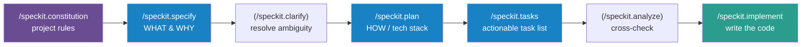
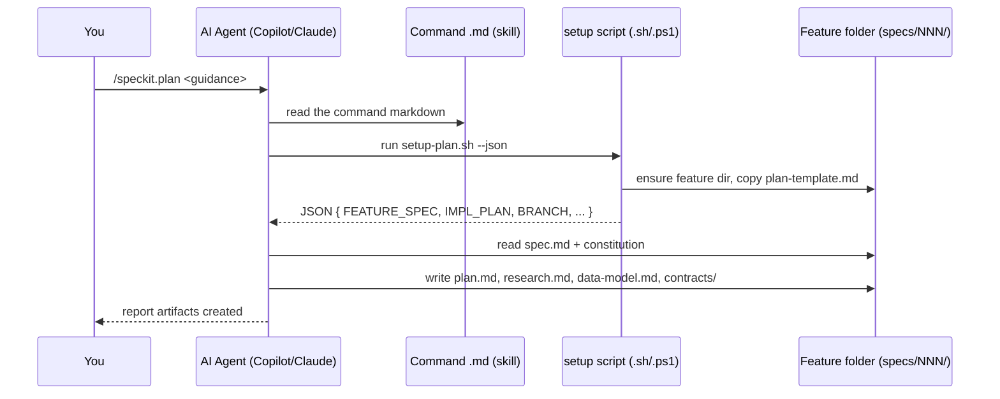
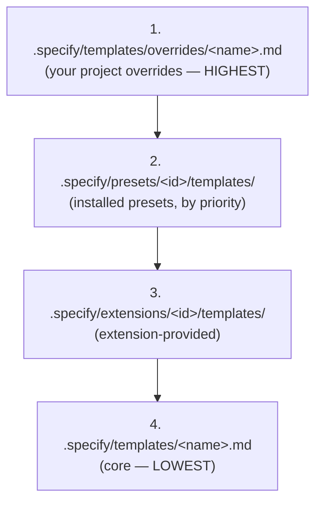
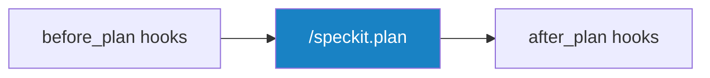
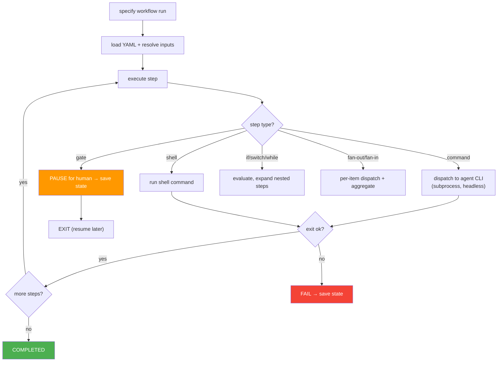
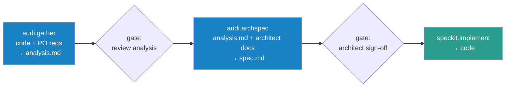

# Spec Kit — Complete Team Guide

> A deep, practical walkthrough of how GitHub **Spec Kit** (the `specify` framework) works internally — how its slash commands, scripts, templates, agents, extensions, and workflow engine fit together — and how to extend it for a custom multi-step pipeline.
>
> Based on a source-code read of the repo at version **`0.11.10.dev0`**.
> Audience: engineers adopting / customizing Spec Kit at work.

---

## Table of Contents

1. [The one thing to understand first](#1-the-one-thing-to-understand-first)
2. [What Spec Kit is](#2-what-spec-kit-is)
3. [Repository layout](#3-repository-layout)
4. [The Spec-Driven Development (SDD) pipeline](#4-the-spec-driven-development-sdd-pipeline)
5. [Slash commands — where they live and how they work](#5-slash-commands--where-they-live-and-how-they-work)
6. [The scripts layer (deterministic glue)](#6-the-scripts-layer-deterministic-glue)
7. [Artifact templates & the override hierarchy](#7-artifact-templates--the-override-hierarchy)
8. [The constitution (project rules)](#8-the-constitution-project-rules)
9. [Integrations (37 supported AI agents)](#9-integrations-37-supported-ai-agents)
10. [Extensions & hooks](#10-extensions--hooks)
11. [Presets](#11-presets)
12. [The Workflow Engine (auto-chaining)](#12-the-workflow-engine-auto-chaining)
13. ["Handoffs" — auto-advance inside the chat](#13-handoffs--auto-advance-inside-the-chat)
14. [The truth about "subagents"](#14-the-truth-about-subagents)
15. [Anatomy of a generated project](#15-anatomy-of-a-generated-project)
16. [Customization cheat-sheet — where to change what](#16-customization-cheat-sheet--where-to-change-what)
17. [Integrating a custom multi-step pipeline](#17-integrating-a-custom-multi-step-pipeline)
18. [Glossary](#18-glossary)

---

## 1. The one thing to understand first

Spec Kit has **two layers**, and almost every "where is X defined?" question depends on which one you mean:

```
┌─────────────────────────────────────────────────────────────┐
│  LAYER 1 — THE TOOL (this repo: github/spec-kit)            │
│  The `specify` CLI + the master templates/scripts.          │
│  You edit this only if you FORK spec-kit.                    │
└─────────────────────────────────────────────────────────────┘
                          │
            `specify init` copies files out
                          ▼
┌─────────────────────────────────────────────────────────────┐
│  LAYER 2 — A GENERATED PROJECT (e.g. your Android app)      │
│  .specify/  +  .claude/skills/  (or .github/ for Copilot)   │
│  This is where teams put THEIR customizations.              │
└─────────────────────────────────────────────────────────────┘
```

**Key implication:** When a team says "we added more rules to Spec Kit," they almost always mean Layer 2 (their generated project's `.specify/` folder, constitution, template overrides, extensions) — *or* they forked Layer 1. To replicate someone's setup, you usually just copy their Layer-2 files; you rarely need their fork.

**Second key truth:** Slash commands are **not code**. They are Markdown prompt files. When you run `/speckit.plan`, your AI agent literally reads that Markdown and follows the instructions in it. The LLM is the engine; Spec Kit just supplies disciplined prompts + a few deterministic shell scripts.

---

## 2. What Spec Kit is

Spec Kit is a toolkit for **Spec-Driven Development (SDD)**: instead of jumping straight to code, you produce a chain of reviewable artifacts — a constitution, a spec, a plan, a task list — and only then implement. Each artifact is generated/refined by an AI coding agent through a structured slash command.

- **CLI name:** `specify` (installed via `uv`/`pipx`; Python package under [`src/specify_cli/`](src/specify_cli/)).
- **Works with 37 AI agents** (Claude Code, GitHub Copilot, Gemini, Cursor, Codex, etc.).
- **Core idea:** the *spec* is the source of truth; code is a downstream artifact.

Recommended background reading already in the repo: [`spec-driven.md`](spec-driven.md), [`docs/concepts/sdd.md`](docs/concepts/sdd.md), [`AGENTS.md`](AGENTS.md).

---

## 3. Repository layout

```
spec-kit/
├── src/specify_cli/          # THE CLI (Python)
│   ├── __init__.py           #   main entrypoint / command wiring
│   ├── commands/             #   `specify init`, bundle, etc.
│   ├── integrations/         #   one folder per supported AI agent (37)
│   ├── workflows/            #   the workflow ENGINE (auto-chaining)
│   │   ├── engine.py         #     runs a YAML pipeline step by step
│   │   ├── steps/            #     step types: command, shell, gate, if, fan-out…
│   │   └── expressions.py    #     {{ }} template expressions
│   ├── extensions/           #   extension install/management
│   └── presets/              #   preset install/management
│
├── templates/                # MASTER content copied into projects
│   ├── commands/             #   ★ the slash-command prompt files (plan.md, …)
│   ├── spec-template.md      #   shape of spec.md
│   ├── plan-template.md      #   shape of plan.md
│   ├── tasks-template.md     #   shape of tasks.md
│   └── constitution-template.md
│
├── scripts/                  # deterministic glue called BY the commands
│   ├── bash/                 #   *.sh  (Linux/macOS/Git-Bash)
│   └── powershell/           #   *.ps1 (Windows)
│
├── extensions/               # bundled extensions (agent-context, git, bug…)
├── presets/                  # bundled presets (lean, scaffold, self-test)
├── workflows/                # bundled workflow definitions (speckit/workflow.yml)
├── docs/                     # full documentation
├── .specify/memory/          # this repo's OWN constitution (dogfooding)
└── AGENTS.md, README.md, spec-driven.md, CHANGELOG.md …
```

The three folders you'll care about most as a customizer: **`templates/commands/`**, **`templates/*-template.md`**, and **`workflows/`**.

---

## 4. The Spec-Driven Development (SDD) pipeline

The canonical flow, with optional steps in parentheses:



Each step **reads the previous artifact and writes the next one**, all inside a per-feature folder (see §15). The artifacts:

| Step | Reads | Writes |
|------|-------|--------|
| `constitution` | your principles | `.specify/memory/constitution.md` |
| `specify` | your feature description | `specs/NNN-feature/spec.md` |
| `clarify` | `spec.md` | updates `spec.md` (Q&A) |
| `plan` | `spec.md` + constitution | `plan.md`, `research.md`, `data-model.md`, `contracts/`, `quickstart.md` |
| `tasks` | `plan.md` + design docs | `tasks.md` (with `[P]` parallel markers) |
| `analyze` | spec + plan + tasks | consistency report (read-only) |
| `implement` | `tasks.md` + design docs | **source code**, marks tasks `[X]` |

---

## 5. Slash commands — where they live and how they work

### Where they're defined

All command logic lives in **[`templates/commands/`](templates/commands/)** — one Markdown file per command:

| Command (markdown / skills form) | Source file | Purpose |
|---|---|---|
| `/speckit.constitution` · `speckit-constitution` | [constitution.md](templates/commands/constitution.md) | Create/update project governing principles |
| `/speckit.specify` · `speckit-specify` | [specify.md](templates/commands/specify.md) | Define what to build (requirements, user stories) |
| `/speckit.clarify` · `speckit-clarify` | [clarify.md](templates/commands/clarify.md) | Ask targeted questions to de-risk the spec |
| `/speckit.plan` · `speckit-plan` | [plan.md](templates/commands/plan.md) | Produce technical plan + design artifacts |
| `/speckit.tasks` · `speckit-tasks` | [tasks.md](templates/commands/tasks.md) | Break plan into an ordered task list |
| `/speckit.analyze` · `speckit-analyze` | [analyze.md](templates/commands/analyze.md) | Cross-check spec/plan/tasks consistency |
| `/speckit.checklist` · `speckit-checklist` | [checklist.md](templates/commands/checklist.md) | Generate a domain quality checklist |
| `/speckit.implement` · `speckit-implement` | [implement.md](templates/commands/implement.md) | Execute tasks and write code |
| `/speckit.taskstoissues` · `speckit-taskstoissues` | [taskstoissues.md](templates/commands/taskstoissues.md) | Push tasks to GitHub issues |
| `/speckit.converge` · `speckit-converge` | [converge.md](templates/commands/converge.md) | Reconcile drift between spec and code |

### Anatomy of a command file

Every command file has **YAML frontmatter** + a **Markdown body of instructions**. Example from [`plan.md`](templates/commands/plan.md):

```yaml
---
description: Execute the implementation planning workflow...
handoffs:                       # ← suggested NEXT commands (see §13)
  - label: Create Tasks
    agent: speckit.tasks
    send: true                  # auto-fire the next command
scripts:                        # ← deterministic helper to run first
  sh: scripts/bash/setup-plan.sh --json
  ps: scripts/powershell/setup-plan.ps1 -Json
---
## User Input
```text
$ARGUMENTS                      # ← whatever the user typed after the command
```
## Outline
1. **Setup**: Run {SCRIPT}, parse JSON for FEATURE_SPEC, IMPL_PLAN, SPECS_DIR…
2. **Load context**: Read FEATURE_SPEC and /memory/constitution.md…
3. **Execute plan workflow**: fill Technical Context, Constitution Check,
   Phase 0 research.md, Phase 1 data-model/contracts/quickstart…
```

Key frontmatter keys:
- **`scripts:`** — a shell helper the agent runs first (returns JSON file paths). Both a `sh` and `ps` variant are shipped; the agent picks one per OS.
- **`handoffs:`** — buttons / auto-advance to the next command (§13).
- **`description:`** — shown in the agent's command picker.

### How a command runs (end to end)



### How they get installed into your agent

`specify init` transforms each `templates/commands/*.md` into the format your chosen agent expects (handled per-integration). For **Claude Code** they become *skills*:

```
.claude/skills/speckit-plan/SKILL.md      ← from templates/commands/plan.md
```

For **GitHub Copilot** (default markdown mode) they become:

```
.github/prompts/speckit.plan.prompt.md
.github/copilot-instructions.md           ← the "context file"
```

> So to tweak a command *in a project*, edit those installed files — not this repo.

---

## 6. The scripts layer (deterministic glue)

Commands delegate all the **non-AI, deterministic** work to shell scripts in [`scripts/bash/`](scripts/bash/) and [`scripts/powershell/`](scripts/powershell/):

| Script | Used by | Does |
|---|---|---|
| `create-new-feature.sh` | `specify` | Compute branch/feature name, make `specs/NNN-name/`, copy spec template, write `.specify/feature.json` |
| `setup-plan.sh` | `plan` | Locate current feature, copy plan template, return JSON paths |
| `setup-tasks.sh` | `tasks` | Locate plan/design docs, prep tasks file |
| `check-prerequisites.sh` | several | Verify required artifacts exist |
| `common.sh` | all | Shared helpers: `get_repo_root`, `resolve_template`, feature-state read/write |

**Why this split matters:** anything deterministic (paths, branch naming, file copying) is in scripts so it's reliable; anything requiring judgment (writing the spec) is left to the LLM. The scripts emit **JSON** that the agent parses to know where to read/write.

State between steps is tracked via:
- the **git branch name** (`001-feature-name`), and
- **`.specify/feature.json`** (the "current feature directory" pointer).

`get_repo_root` ([common.sh](scripts/bash/common.sh)) finds the project by walking up to the `.specify/` directory.

---

## 7. Artifact templates & the override hierarchy

The **shape of each output document** is controlled by templates in [`templates/`](templates/):

- [`spec-template.md`](templates/spec-template.md) → structure of `spec.md`
- [`plan-template.md`](templates/plan-template.md) → structure of `plan.md`
- [`tasks-template.md`](templates/tasks-template.md) → structure of `tasks.md`
- [`constitution-template.md`](templates/constitution-template.md)

In a generated project these land in `.specify/templates/`. **Editing these is the most common way to change "what each step produces."**

### The resolution priority stack

`resolve_template()` in [`common.sh`](scripts/bash/common.sh) searches in this order (first match wins):



**This is the upgrade-safe customization seam.** Drop a file in `.specify/templates/overrides/` and it beats the core template without forking Spec Kit. A whole team can ship a preset (priority 2) to standardize structure across projects.

---

## 8. The constitution (project rules)

The **constitution** is the project's "rules book" — engineering principles, testing standards, architectural constraints. It lives at:

```
.specify/memory/constitution.md
```

- Created/edited by `/speckit.constitution`.
- **Read by `/speckit.plan`** ("Read FEATURE_SPEC and /memory/constitution.md").
- The plan command performs a **"Constitution Check"** gate and ERRORs on unjustified violations.

> If your team "configured more rules," the constitution is the **first place to look** — it's the intended home for org-wide engineering rules and is enforced during planning.

---

## 9. Integrations (37 supported AI agents)

Each supported agent has a folder in [`src/specify_cli/integrations/`](src/specify_cli/integrations/). The 37:

```
agy  amp  auggie  bob  claude  cline  codebuddy  codex  copilot
cursor_agent  devin  firebender  forge  gemini  generic  goose
hermes  iflow  junie  kilocode  kimi  kiro_cli  lingma  omp
opencode  pi  qodercli  qwen  roo  rovodev  shai  tabnine
trae  vibe  windsurf  zcode  zed
```

An integration defines, per agent:
- **`folder` / `commands_subdir`** — where commands get installed (e.g. `.claude/skills`, `.github/prompts`).
- **`format`** — markdown / toml / etc.
- **`args`** placeholder — e.g. `$ARGUMENTS`.
- **`context_file`** — the always-loaded instructions file (e.g. `CLAUDE.md`, `.github/copilot-instructions.md`).
- **`dispatch_command()`** — how to invoke the agent **non-interactively** (used by the workflow engine — see §12).

Example: the Claude integration ([claude/__init__.py](src/specify_cli/integrations/claude/__init__.py)) installs commands as `.claude/skills/speckit-*/SKILL.md` and uses `CLAUDE.md` as its context file. Copilot ([copilot/__init__.py](src/specify_cli/integrations/copilot/__init__.py)) installs `.github/prompts/*.prompt.md` + `.vscode/settings.json` and can also run in `--skills` mode.

You choose at init time:
```bash
specify init my-project --integration copilot
specify init my-project --integration claude --integration-options="--skills"
```

---

## 10. Extensions & hooks

Extensions add commands and **lifecycle hooks** without bloating core. Bundled examples live in [`extensions/`](extensions/) (`agent-context`, `git`, `bug`, `selftest`, `template`).

### Hooks: inject steps before/after each phase

Hooks are configured per-project in **`.specify/extensions.yml`**. Every core command checks this file for keys like `before_plan`, `after_implement`, etc. Sample ([tests/hooks/.specify/extensions.yml](tests/hooks/.specify/extensions.yml)):

```yaml
hooks:
  before_implement:
    - id: pre_test
      enabled: true
      optional: false          # mandatory → auto-runs and blocks
      extension: "test-extension"
      command: "pre_implement_test"
      description: "Run tests before implementing"
  after_tasks:
    - id: post_test
      optional: true           # optional → offered to the user, not forced
      prompt: "Run the post-tasks test?"
```



- **`optional: false`** → the command auto-executes the hook and waits (mandatory gate).
- **`optional: true`** → the command surfaces it as a suggestion.

This is the clean way to add lint gates, ticket creation, compliance checks, etc., **without editing core command files**.

Docs: [extensions/EXTENSION-USER-GUIDE.md](extensions/EXTENSION-USER-GUIDE.md), [extensions/EXTENSION-DEVELOPMENT-GUIDE.md](extensions/EXTENSION-DEVELOPMENT-GUIDE.md).

---

## 11. Presets

Presets ([`presets/`](presets/): `lean`, `scaffold`, `self-test`) are **bundles of template overrides + config** that reshape the whole workflow for a style of work. They sit at priority 2 in the template stack (§7), so a team can publish one preset and have every project inherit a consistent spec/plan/tasks structure. Manage with `specify` preset commands; see [presets/README.md](presets/README.md).

---

## 12. The Workflow Engine (auto-chaining)

This is what makes Spec Kit run **all steps automatically** without you typing each command — and is almost certainly what an internal "one-command pipeline" (e.g. an "AUDI"-style runner) is built on.

### Definition

A workflow is a YAML file. The bundled one is [`workflows/speckit/workflow.yml`](workflows/speckit/workflow.yml):

```yaml
workflow:
  id: speckit
  name: "Full SDD Cycle"
steps:
  - id: specify
    command: speckit.specify
    integration: "{{ inputs.integration }}"
    input: { args: "{{ inputs.spec }}" }
  - id: review-spec
    type: gate                         # ← pauses for human approval
    options: [approve, reject]
    on_reject: abort
  - id: plan
    command: speckit.plan
  - id: review-plan
    type: gate
  - id: tasks
    command: speckit.tasks
  - id: implement
    command: speckit.implement
```

### Running it

```bash
specify workflow add speckit
specify workflow run speckit --input spec="Build an OAuth login system"
specify workflow status
specify workflow resume <run_id>     # continue after a gate pause
```

### How it executes

The engine ([`workflows/engine.py`](src/specify_cli/workflows/engine.py)) loads the YAML and runs steps **sequentially**. For each `command` step it calls the integration's `dispatch_command()`, which **spawns the agent CLI as a subprocess, non-interactively** ([base.py](src/specify_cli/integrations/base.py)):

```python
subprocess.run([copilot, ...slash-command + args...])   # one step at a time
```



### Step types (11 built-in)

Each lives under [`src/specify_cli/workflows/steps/`](src/specify_cli/workflows/steps/):

| Type | Purpose |
|---|---|
| `command` | Invoke an installed Spec Kit command via the agent CLI |
| `prompt` | Send an arbitrary inline prompt to the agent |
| `shell` | Run a shell command, capture output |
| `init` | Bootstrap a project (`specify init`) |
| `gate` | Human review/approval (pauses; resumable) |
| `if` | Conditional then/else |
| `switch` | Multi-branch on an expression |
| `while` / `do-while` | Loops |
| `fan-out` / `fan-in` | Dispatch per item over a collection, then aggregate |

### Two critical facts for customizers

1. **Per-step agent & model.** Each step may set its own `integration:` and `model:` (resolved in [command/__init__.py](src/specify_cli/workflows/steps/command/__init__.py)). So different steps can use different AI agents / teams.
2. **Steps do NOT pass file *contents* through `{{ }}` variables.** A command step's output only captures `exit_code` / `stdout` / `stderr` (and stdout is empty while streaming). **The real handoff medium is the filesystem** — the feature folder `specs/NNN/` + `.specify/feature.json`. Design every step to read the previous artifact *from disk*, not from a workflow variable.

Docs: [workflows/README.md](workflows/README.md), [workflows/ARCHITECTURE.md](workflows/ARCHITECTURE.md).

---

## 13. "Handoffs" — auto-advance inside the chat

Even **without** the workflow engine, stock commands chain themselves via the `handoffs:` frontmatter key with `send: true`:

```
specify.md  --(send:true)-->  plan
plan.md     --(send:true)-->  tasks
tasks.md    --(send:true)-->  implement
```

`send: true` means: when this command finishes, **automatically fire the next command** in the same chat session (rather than just showing a button). In agents that honor handoffs, finishing `/speckit.specify` cascades through plan → tasks → implement on its own — which also feels like "it ran every step by itself," but happens **inside the chat panel**, not via a subprocess.

> Not every agent supports handoffs (e.g. Forge strips the key — see [AGENTS.md](AGENTS.md)). Copilot support depends on its mode.

**Workflow engine vs handoffs — how to tell which a teammate used:**

| Signal | Mechanism |
|---|---|
| They typed a command in the **terminal** (`specify workflow run …` / `audi workflow run …`) | Workflow engine (or a renamed fork) |
| They typed **one slash command in the chat** and it cascaded | Handoffs `send: true` (or a custom umbrella command) |

---

## 14. The truth about "subagents"

A common misconception: that each command (`plan`, `implement`, …) has a defined set of subagents with a known count. **It does not.** Commands are Markdown prompts; there is no agent roster and no configured count anywhere.

What actually exists:

| What you see | What it really is | A subagent? |
|---|---|---|
| `handoffs:` / `agent: speckit.tasks` | The **next command** to chain to | ❌ |
| `[P]` markers in `tasks.md` / `implement.md` | Tasks that *may* run concurrently (metadata) | ❌ |
| "dispatch research agents" in `plan.md` | Prose telling the LLM it *may* spin up research tasks | ⚠️ only real one, count is dynamic |

- **Only `plan` contains an agent-dispatch instruction**, and the count is emergent: roughly *(# of "NEEDS CLARIFICATION" unknowns) + (# of tech/dependency choices)* — decided at runtime, not configured.
- Whether those run as *real* parallel subagents depends entirely on your AI tool, not Spec Kit.
- `tasks` and `implement` only **read/write `[P]` markers**; the agent decides whether to actually parallelize.
- All other commands (`specify`, `clarify`, `constitution`, `analyze`, `checklist`, `taskstoissues`, `converge`) contain **zero** dispatch instructions.

**Where to "check subagents":** read the command Markdown itself. If multi-agent behavior isn't written there in plain English, it doesn't happen. To get **defined, countable** agents you must add them yourself — either as explicit prose in a command file, or via a `fan-out` workflow step (count = size of the collection).

---

## 15. Anatomy of a generated project

After `specify init`, a project looks like this (Claude example):

```
my-project/
├── .specify/
│   ├── memory/
│   │   └── constitution.md          # project rules (§8)
│   ├── templates/
│   │   ├── spec-template.md          # core artifact templates (§7)
│   │   ├── plan-template.md
│   │   ├── tasks-template.md
│   │   └── overrides/               # ← drop overrides here (highest priority)
│   ├── scripts/                      # bash + powershell helpers
│   ├── extensions/                   # installed extensions
│   ├── presets/                      # installed presets
│   ├── extensions.yml                # hook configuration (§10)
│   └── feature.json                  # "current feature" pointer
│
├── .claude/skills/                   # the slash commands as skills
│   ├── speckit-specify/SKILL.md
│   ├── speckit-plan/SKILL.md
│   └── …
├── CLAUDE.md                         # always-loaded agent context
│
└── specs/                            # one folder per feature
    └── 001-user-auth/
        ├── spec.md
        ├── plan.md
        ├── research.md
        ├── data-model.md
        ├── contracts/
        ├── quickstart.md
        └── tasks.md
```

> For Copilot, swap `.claude/skills/` → `.github/prompts/` and `CLAUDE.md` → `.github/copilot-instructions.md`.

**To clone a teammate's customized setup**, copy their: `.specify/memory/constitution.md`, `.specify/templates/overrides/`, `.specify/presets/`, `.specify/extensions.yml`, and (if they edited commands directly) their `.claude/skills/speckit-*/` or `.github/prompts/`.

---

## 16. Customization cheat-sheet — where to change what

| I want to… | Edit this | Notes |
|---|---|---|
| Change a step's **output structure** | `.specify/templates/<name>-template.md` or `…/overrides/<name>.md` | Override wins; upgrade-safe |
| Change a step's **behavior/instructions** | the installed command file (`.claude/skills/speckit-*/SKILL.md` or `.github/prompts/*.prompt.md`) | Or fork `templates/commands/` |
| Add **org-wide rules** | `.specify/memory/constitution.md` | Enforced by `plan` |
| **Inject a step** before/after a phase | `.specify/extensions.yml` hooks | `optional: false` = mandatory |
| **Attach reference docs** to a step | a `docs/…` folder referenced in the command, the constitution, or the context file (`CLAUDE.md`) | See §17 |
| **Auto-run all steps** | a workflow YAML + `specify workflow run` | Or `handoffs: send:true` |
| Use a **different agent per step** | `integration:` / `model:` on each workflow step | Per-step override |
| Add **defined multi-agent** behavior | explicit prose in a command, or a `fan-out` step | No hidden roster exists |
| Standardize across many projects | a **preset** | Priority 2 in template stack |

### Where to attach more files / technical docs (FAQ)

1. **A referenced docs folder** — e.g. `docs/architecture/`, and add to the command: *"Read all files in `docs/architecture/` as authoritative technical context."* Best for per-feature docs.
2. **The constitution** — for rules that should constrain *every* plan.
3. **The context file** (`CLAUDE.md` / `copilot-instructions.md`) — always loaded into the agent.
4. **Inline** — just reference paths in the command args: `/speckit.plan Follow patterns in docs/architecture.md and api/openapi.yaml`. `$ARGUMENTS` feeds straight into the prompt and the agent can read referenced files.

---

## 17. Integrating a custom multi-step pipeline

Suppose another team has a 3-step process, each step driven by its own agents:

1. **Gather** — agents read existing code + PO requirements → produce `analysis.md` (logic + requirements).
2. **Spec** — agents take step-1 output + senior-architect technical docs → produce a detailed `spec.md` (exact packages, file names, changes).
3. **Implement** — take the spec → write the code.

This maps almost 1:1 onto Spec Kit:



### Step ↔ Spec Kit construct

| Their step | Spec Kit equivalent | Implement as |
|---|---|---|
| 1. Gather | front half of `specify` | new command `audi.gather` (+ `analysis-template.md`) |
| 2. Spec | `plan` + `tasks` | new command `audi.archspec` (+ strict `spec-template.md`) |
| 3. Implement | `implement` | reuse `speckit.implement` |

### Where "their own agents" plug in — choose the seam

- **If their agents are LLM prompts** → make each step a **command** (skill `.md`). Inside the markdown, instruct the model to dispatch its sub-agents, or use a **`fan-out`** step (one agent per data source) + **`fan-in`** to aggregate.
- **If their agents are standalone programs/scripts** → wrap each as a **`shell`** step in the workflow; the agents run as their own processes and Spec Kit just orchestrates.
- **Mixed** is fine — `shell` step for gathering, `command` steps for spec + implement.

### Artifact flow — use the feature folder

Wire all three steps to the **same feature directory** so they hand off via disk (remember §12 fact #2):

```
specs/001-feature/
  analysis.md   ← step 1 writes
  spec.md       ← step 2 writes (reads analysis.md + docs/architecture/)
  tasks.md      ← step 2 writes
  <code>        ← step 3 writes
.specify/feature.json   ← set by step 1's setup script
```

Do **not** try to pass files via `{{ steps.gather.output.file }}` — pass them through the folder.

### Where the architect docs go (step 2's extra input)

- Drop them in `docs/architecture/` and have `audi.archspec` read that folder (best for per-feature docs), **and/or**
- put org-wide architecture rules in the **constitution**, **and/or**
- pin output quality with a strict `spec-template.md` that has explicit sections: `## Files to change`, `## New packages`, `## Public contracts`.

### Sample AUDI workflow YAML

```yaml
# workflows/audi/workflow.yml
schema_version: "1.0"
workflow:
  id: audi
  name: "AUDI SDD Cycle"
  version: "1.0.0"

inputs:
  po_requirements: { type: string, required: true, prompt: "PO requirements" }
  integration:     { type: string, default: "copilot" }

steps:
  - id: gather
    command: audi.gather
    integration: "{{ inputs.integration }}"
    input: { args: "{{ inputs.po_requirements }}" }

  - id: review-analysis
    type: gate
    message: "Review analysis.md before spec authoring."
    options: [approve, reject]
    on_reject: abort

  - id: archspec
    command: audi.archspec
    integration: "{{ inputs.integration }}"
    model: "claude-opus-4-8"
    input: { args: "{{ inputs.po_requirements }}" }

  - id: review-spec
    type: gate
    message: "Architect sign-off on spec.md before implementation."
    options: [approve, reject]
    on_reject: abort

  - id: implement
    command: speckit.implement
    integration: "{{ inputs.integration }}"
```

For a Case-B (external script) gather step:

```yaml
  - id: gather
    type: shell
    run: "python tools/gather_crew.py --po '{{ inputs.po_requirements }}'
          --out specs/$(jq -r .feature_directory .specify/feature.json)/analysis.md"
```

### Build checklist

- [ ] `audi.gather` command file + `analysis-template.md`
- [ ] `audi.archspec` command file + strict `spec-template.md` (file/package sections) + architect-docs reference
- [ ] Reuse `speckit.implement` (or `audi.implement` if tweaks needed)
- [ ] `workflows/audi/workflow.yml` (above)
- [ ] A `create-new-feature`-style setup script so `feature.json` is set in step 1

---

## 18. Glossary

| Term | Meaning |
|---|---|
| **SDD** | Spec-Driven Development — generate reviewable specs before code |
| **Integration** | An adapter for a specific AI agent (Claude, Copilot, …); 37 supported |
| **Command / Skill** | A Markdown prompt file the agent follows (e.g. `plan.md`) |
| **Context file** | Always-loaded instructions for the agent (`CLAUDE.md`, `copilot-instructions.md`) |
| **Constitution** | The project's rule book; enforced during planning |
| **Template** | Defines the structure of an output artifact (spec/plan/tasks) |
| **Override** | A project-local template that beats core (highest priority) |
| **Preset** | A shareable bundle of overrides/config |
| **Extension** | A package adding commands + lifecycle hooks |
| **Hook** | A command injected before/after a phase via `extensions.yml` |
| **Workflow** | A YAML pipeline run by the engine (`specify workflow run`) |
| **Step** | One node in a workflow (`command`, `shell`, `gate`, `fan-out`, …) |
| **Gate** | A workflow pause for human approval (resumable) |
| **Handoff** | Frontmatter that auto-advances to the next command (`send: true`) |
| **Feature folder** | `specs/NNN-name/` — where one feature's artifacts live |
| **`feature.json`** | `.specify/feature.json`, the "current feature" pointer |

---

### Quick reference — the files that matter most

| Concern | File(s) |
|---|---|
| Command logic | [`templates/commands/*.md`](templates/commands/) |
| Output structure | [`templates/*-template.md`](templates/) |
| Deterministic glue | [`scripts/bash/*.sh`](scripts/bash/) · [`scripts/powershell/*.ps1`](scripts/powershell/) |
| Agent adapters | [`src/specify_cli/integrations/`](src/specify_cli/integrations/) |
| Workflow engine | [`src/specify_cli/workflows/engine.py`](src/specify_cli/workflows/engine.py) |
| Workflow defs | [`workflows/*/workflow.yml`](workflows/) |
| Project rules | `.specify/memory/constitution.md` |
| Hooks | `.specify/extensions.yml` |

---

*Generated from a source read of `github/spec-kit` @ `0.11.10.dev0`. For deeper detail see [`README.md`](README.md), [`AGENTS.md`](AGENTS.md), [`spec-driven.md`](spec-driven.md), [`workflows/ARCHITECTURE.md`](workflows/ARCHITECTURE.md), and [`docs/`](docs/).*
