# Spec Kit — The Visual Guide

> Everything about GitHub **Spec Kit** (the `specify` toolkit for **Spec-Driven Development**) explained in **diagrams**.
>
> Every concept here is also covered in prose in the companion files — `SPECKIT-COMPLETE-GUIDE.md` (tutorial), `SPECKIT-TEAM-GUIDE.md` (reference), `SPECKIT-AGENT-CONTEXT.md` (agent context). This file is the **map**: skim the pictures, then dive into the prose when you need detail.
>
> All diagrams are **Mermaid** — they render automatically on GitHub. Based on a source read of `github/spec-kit` (`0.11.x`).

---

## How to read this guide


**Table of contents**

| # | Section | # | Section |
|---|---|---|---|
| 1 | [The big picture](#1-the-big-picture) | 18 | [Skills vs prompt mode](#18-skills-mode-vs-prompt-mode) |
| 2 | [The power inversion (SDD)](#2-the-power-inversion-sdd) | 19 | [Greenfield / brownfield / exploration](#19-greenfield--brownfield--exploration-modes) |
| 3 | [The two-layer model](#3-the-two-layer-model) | 20 | [Three ways to chain steps](#20-three-ways-to-chain-steps) |
| 4 | [Prompts + scripts + filesystem](#4-prompts--scripts--filesystem) | 21 | [The workflow engine](#21-the-workflow-engine) |
| 5 | [Install decision tree](#5-install-decision-tree) | 22 | [Headless / CI flow](#22-headless--ci-flow) |
| 6 | [What `init` does](#6-what-specify-init-does) | 23 | [Customization decision tree](#23-customization-decision-tree) |
| 7 | [Generated project layout](#7-generated-project-layout) | 24 | [Template override hierarchy](#24-template-override-hierarchy) |
| 8 | [Where files land per agent](#8-where-files-land-per-agent) | 25 | [Adding a new Markdown artifact](#25-adding-a-new-markdown-artifact) |
| 9 | [The pipeline at a glance](#9-the-pipeline-at-a-glance) | 26 | [Adding a brand-new command](#26-adding-a-brand-new-command) |
| 10 | [Artifact dependency graph](#10-artifact-dependency-graph) | 27 | ["Custom agents" — the 3 meanings](#27-custom-agents--the-three-meanings) |
| 11 | [Anatomy of a command file](#11-anatomy-of-a-command-file) | 28 | [Hooks lifecycle](#28-hooks-lifecycle) |
| 12 | [How one command runs](#12-how-one-command-runs-sequence) | 29 | [Extensions / presets / bundles](#29-extensions--presets--bundles) |
| 13 | [`constitution` & `specify`](#13-constitution--specify) | 30 | [Fan-out / fan-in](#30-fan-out--fan-in-real-parallel-agents) |
| 14 | [`clarify` & `plan`](#14-clarify--plan) | 31 | [Upgrade safety map](#31-upgrade-safety-map) |
| 15 | [`tasks`, `analyze`, `checklist`](#15-tasks-analyze-checklist) | 32 | [Team distribution ladder](#32-team-distribution-ladder) |
| 16 | [`implement` & `converge`](#16-implement--converge) | 33 | [What to commit](#33-what-to-commit) |
| 17 | [Integrations landscape](#17-integrations-landscape) | 34 | [Troubleshooting flowchart](#34-troubleshooting-flowchart) |
| | | 35 | [Use-case playbooks](#35-use-case-playbooks) |

---
---

# PART I — CONCEPTS

## 1. The big picture

Spec Kit turns a vague idea into working code through a chain of **reviewable Markdown artifacts**, each produced by an AI agent following a disciplined prompt.

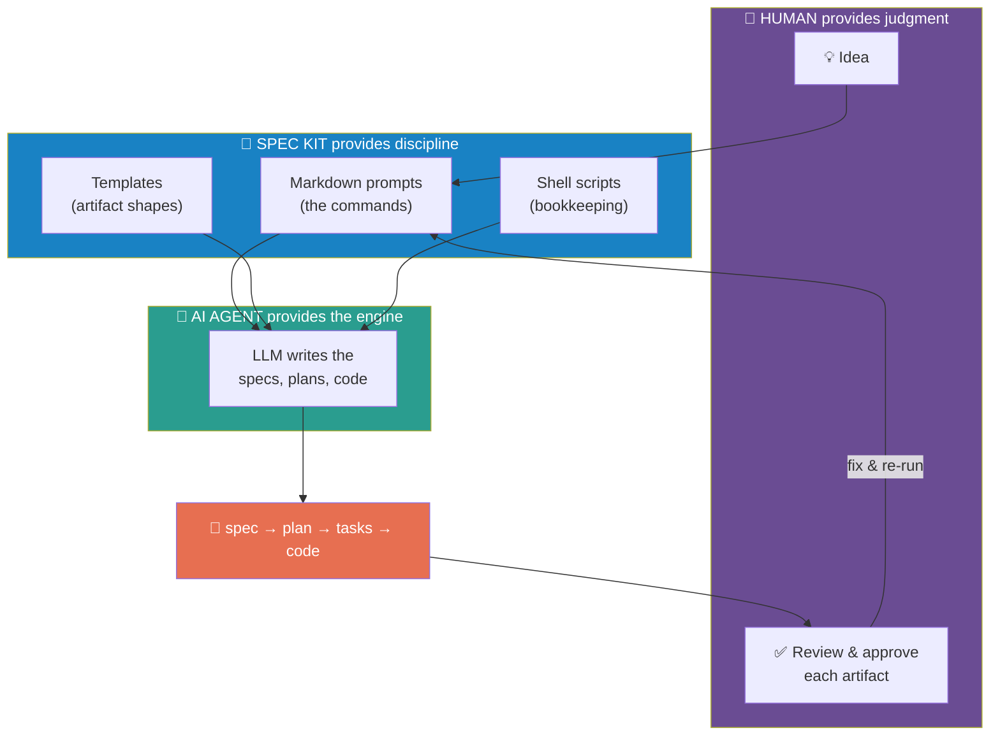

**Key:** Spec Kit has no LLM of its own. You bring the agent; Spec Kit supplies the *process*.

---

## 2. The power inversion (SDD)

Traditional development treats the spec as throwaway scaffolding. Spec-Driven Development flips it: the **spec is the source of truth**, and code is a build product.

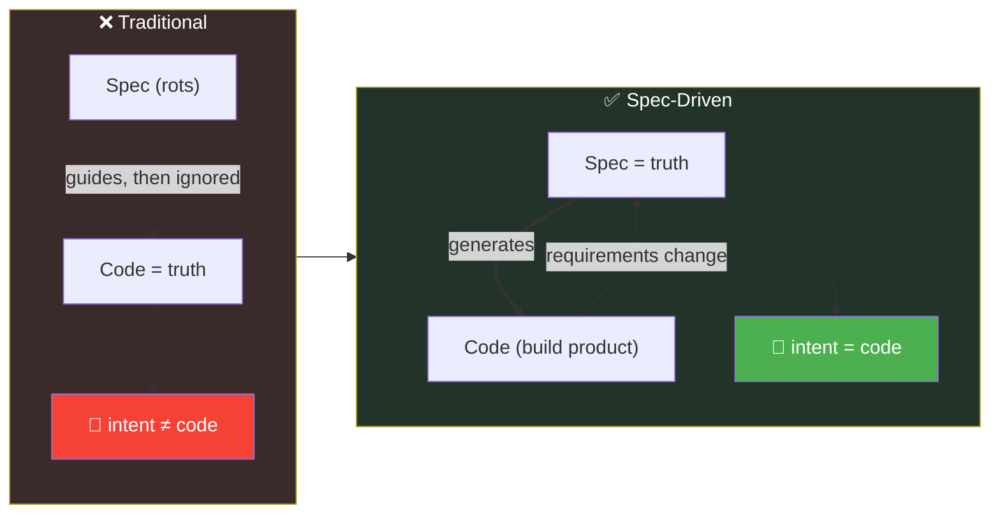

The lifecycle isn't one-way — specs evolve from operational reality: `0 → 1 → 1' → 2 → 3 → N`.

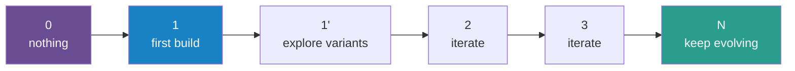

---

## 3. The two-layer model

The single most important mental model. Almost every "where do I change X?" answer depends on which layer you mean.

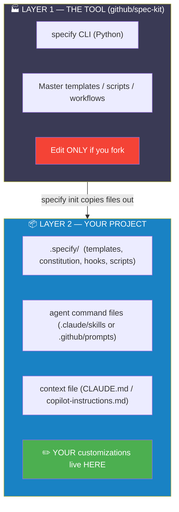

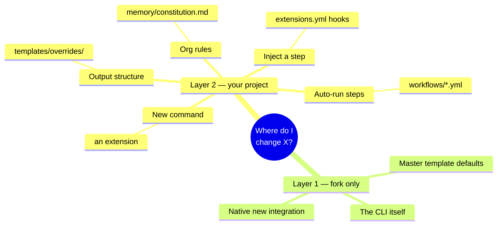

---

## 4. Prompts + scripts + filesystem

Every step splits work into **judgment** (LLM) and **bookkeeping** (scripts), and steps hand off through **files on disk** — never through memory.

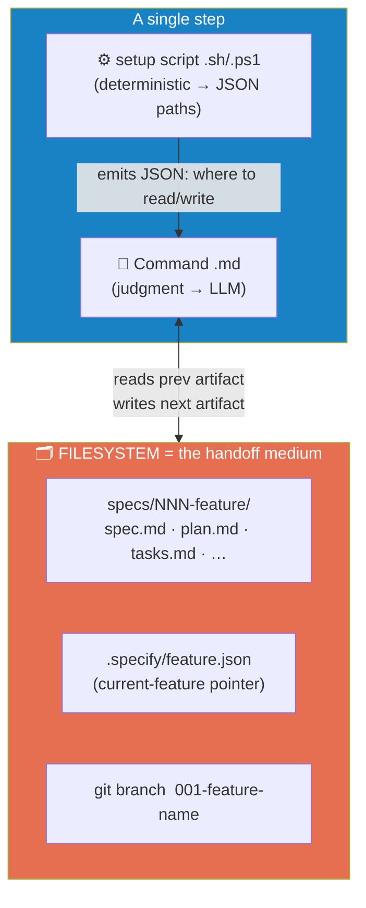

The "current feature" is identified by three cooperating signals:

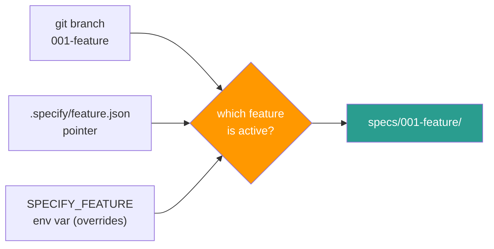

---
---

# PART II — SETUP & INIT

## 5. Install decision tree

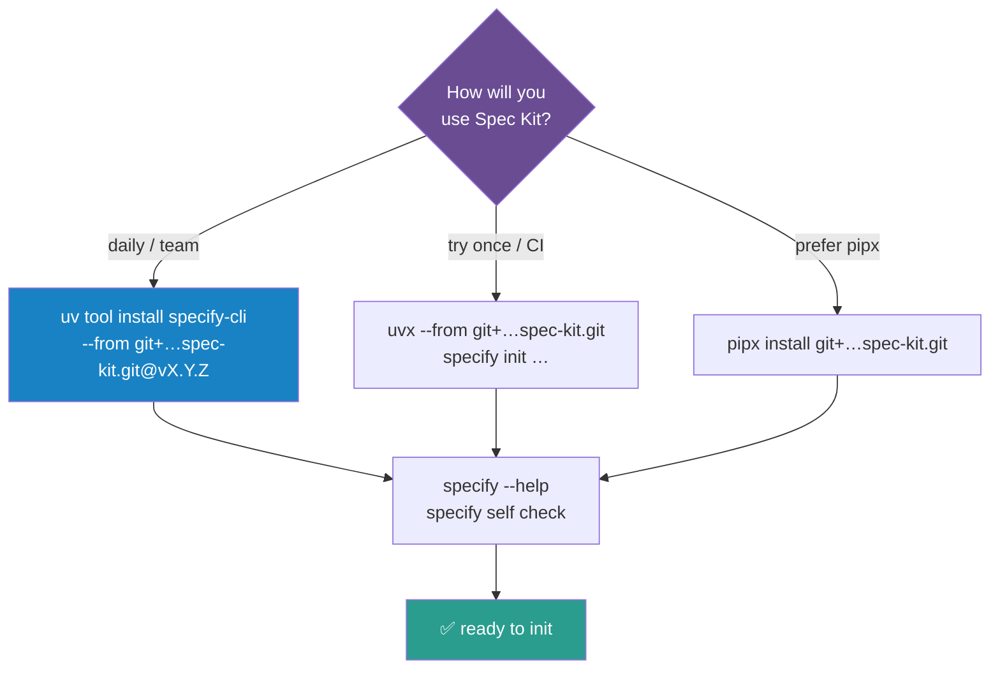

> **Pin a tag** (`@v0.11.9`) for teams so everyone runs identical templates/scripts.

---

## 6. What `specify init` does

`init` is the moment Layer 1 copies files into Layer 2. **No AI runs. It's fully offline.**

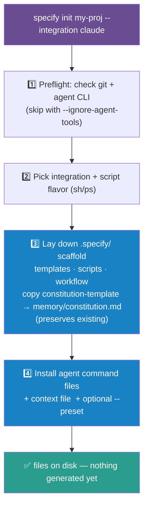

The flags, visually:

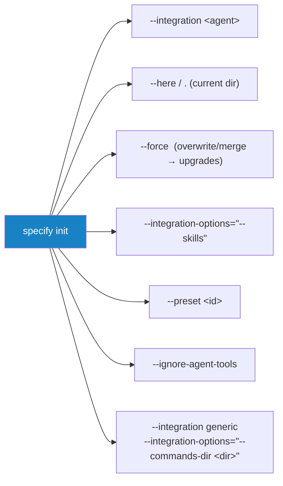

---

## 7. Generated project layout

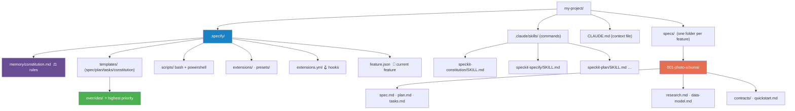

---

## 8. Where files land per agent

Command **content is identical** across agents; only the **packaging/location** differs.

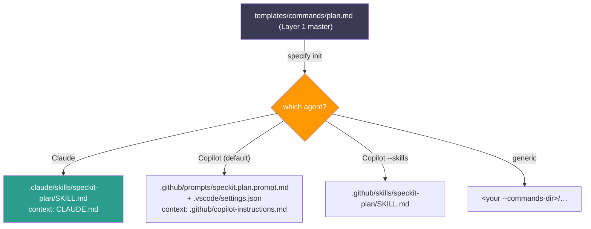

---
---

# PART III — THE PIPELINE

## 9. The pipeline at a glance

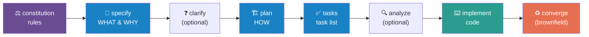

Each command reads one artifact and writes the next:

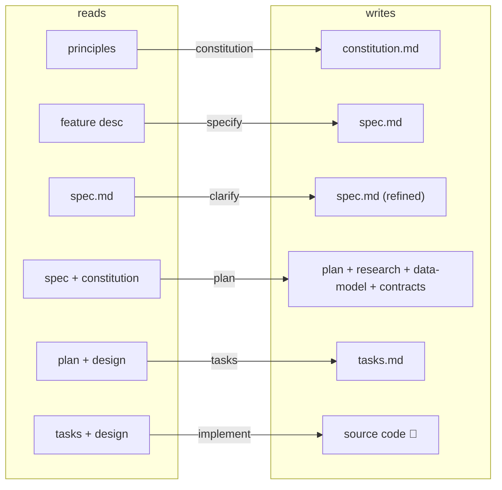

---

## 10. Artifact dependency graph

Who-reads-what. This is the real wiring of the pipeline.

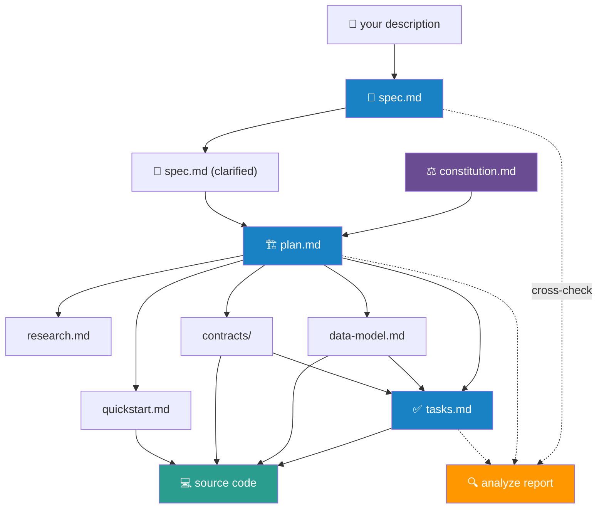

---

## 11. Anatomy of a command file

Every command = **YAML frontmatter + Markdown body**.

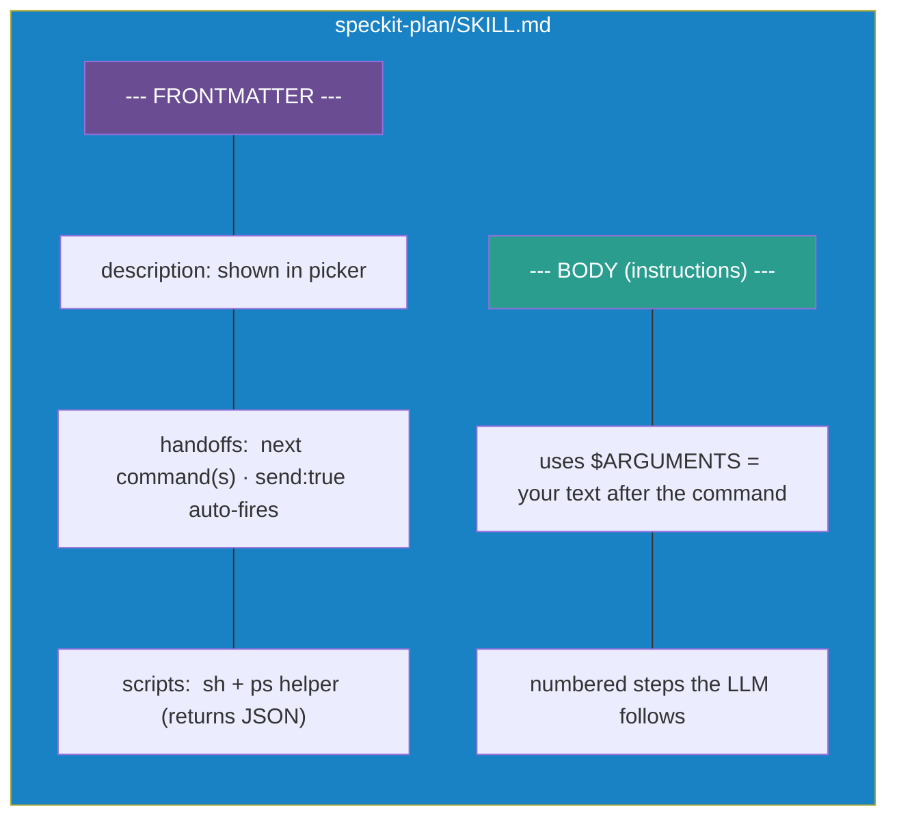

---

## 12. How one command runs (sequence)

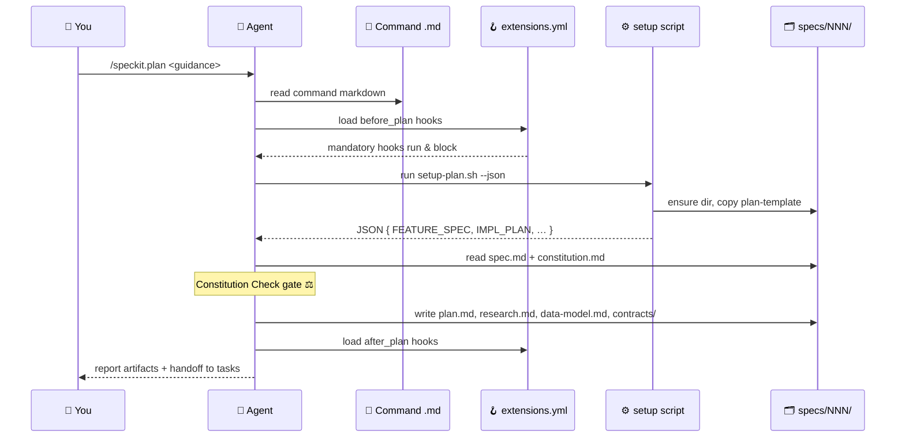

---

## 13. `constitution` & `specify`

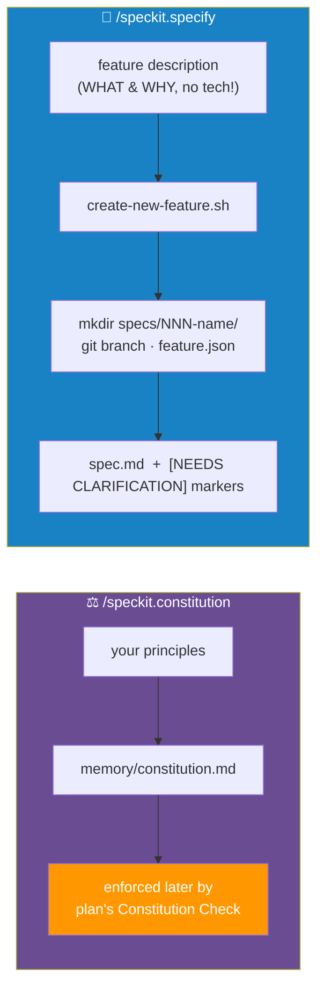

> ⚠️ **Anti-pattern:** putting tech ("React + Postgres") in `specify`. Tech belongs in `plan`. A tech-free spec lets you explore multiple stacks later.

---

## 14. `clarify` & `plan`

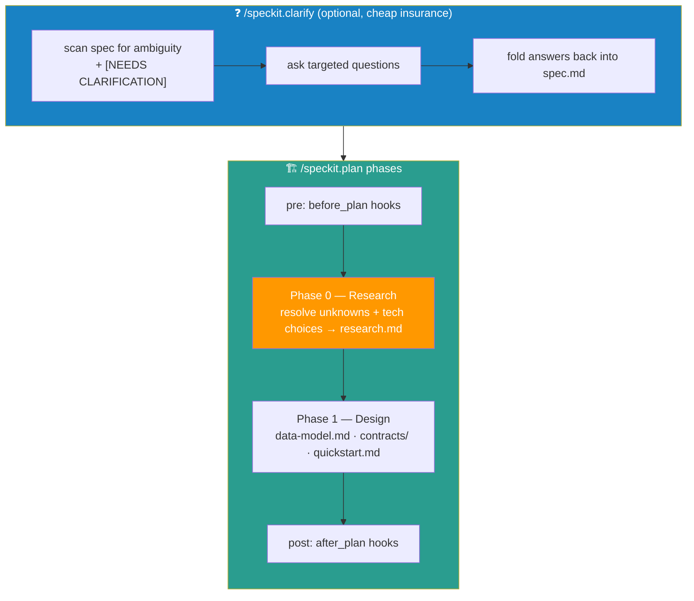

The **Constitution Check** is the gate that makes org rules stick:

```mermaid
flowchart TD
    plan["plan reads constitution"] --> check{plan violates<br/>a principle?}
    check -->|no| ok["✅ proceed"]
    check -->|"yes + justified"| just["⚠️ document &amp; proceed"]
    check -->|"yes, unjustified"| err["🛑 ERROR — surface it"]
    style check fill:#ff9800,color:#fff
    style ok fill:#4caf50,color:#fff
    style err fill:#f44336,color:#fff
```

---

## 15. `tasks`, `analyze`, `checklist`

```mermaid
flowchart LR
    plan["plan.md + design"] --> tasks["✅ /speckit.tasks"]
    tasks --> tm["tasks.md<br/>ordered · [P] = parallelizable<br/>per-story Independent Tests"]
    tm -.->|"optional gate"| an["🔍 /speckit.analyze<br/>consistency report (read-only)"]
    tm -.->|"optional gate"| ck["📋 /speckit.checklist<br/>domain quality checklist"]
    style tasks fill:#1982c4,color:#fff
    style an fill:#ff9800,color:#fff
    style ck fill:#ff9800,color:#fff
```

Task marker meanings:

```mermaid
flowchart LR
    t1["- [ ] T01 …"] -->|"not started"| open["⬜ open"]
    t2["- [ ] T02 [P] …"] -->|"may run in parallel"| par["⚡ parallelizable (metadata)"]
    t3["- [X] T03 …"] -->|"implement marks done"| done["✅ complete (resumable/auditable)"]
    style done fill:#4caf50,color:#fff
    style par fill:#1982c4,color:#fff
```

---

## 16. `implement` & `converge`

```mermaid
flowchart TB
    subgraph imp["⌨️ /speckit.implement (greenfield)"]
        direction TB
        i1["walk tasks.md in dependency order"] --> i2["honor [P] for parallel work"]
        i2 --> i3["write real source files<br/>(44+ language/tool profiles)"]
        i3 --> i4["mark tasks [X]"]
        i4 --> i5["completion validation<br/>(tests / quickstart)"]
    end
    subgraph cv["♻️ /speckit.converge (brownfield)"]
        direction TB
        v1["read EXISTING codebase"] --> v2["compare vs spec/plan/tasks"]
        v2 --> v3["append ONLY unbuilt work"]
        v3 --> v4["no rewrite — adopt SDD onto legacy"]
    end
    style imp fill:#2a9d8f,color:#fff
    style cv fill:#e76f51,color:#fff
```

---
---

# PART IV — AGENTS & MODES

## 17. Integrations landscape

An **integration** is an adapter for one AI agent. 30+ supported.

```mermaid
flowchart TB
    sk["specify CLI"] --> integ["integrations/&lt;agent&gt;/"]
    integ --> claude["claude"]
    integ --> copilot["copilot"]
    integ --> gemini["gemini"]
    integ --> cursor["cursor_agent"]
    integ --> codex["codex"]
    integ --> more["…30+ total: qwen, opencode,<br/>windsurf, zed, kilocode, roo, …"]
    integ --> generic["generic ← bring-your-own-agent"]

    claude --> def["each defines:<br/>• install folder<br/>• command format<br/>• $ARGUMENTS placeholder<br/>• context_file<br/>• dispatch_command() (headless)"]
    style sk fill:#1982c4,color:#fff
    style generic fill:#4caf50,color:#fff
    style def fill:#6a4c93,color:#fff
```

`dispatch_command()` is what lets the workflow engine and CI run agents non-interactively.

---

## 18. Skills mode vs prompt mode

```mermaid
flowchart TD
    cmd["a command (e.g. plan)"] --> mode{agent mode?}
    mode -->|"skills (Claude, Copilot --skills)"| sk["folder: speckit-plan/SKILL.md<br/>auto-discovered, namespaced"]
    mode -->|"prompt/command (Copilot default)"| pr["flat: speckit.plan.prompt.md"]
    sk --> same["⚠️ SAME content —<br/>only discovery/packaging differs"]
    pr --> same
    style mode fill:#ff9800,color:#fff
    style same fill:#2a9d8f,color:#fff
```

---

## 19. Greenfield / brownfield / exploration modes

Same machinery, three ways to use it.

```mermaid
flowchart TB
    spec["📄 spec.md (one source of truth)"]
    spec --> gf["🌱 GREENFIELD (0→1)<br/>full specify→implement"]
    spec --> ce["🎨 EXPLORATION (1')<br/>same spec, many plans<br/>on separate branches → compare"]
    spec --> bf["🏚️ BROWNFIELD<br/>converge: assess code,<br/>append missing work<br/>+ regression gate"]
    style spec fill:#1982c4,color:#fff
    style gf fill:#2a9d8f,color:#fff
    style ce fill:#6a4c93,color:#fff
    style bf fill:#e76f51,color:#fff
```

Exploration in detail — why the spec must stay tech-free:

```mermaid
flowchart LR
    s["spec.md (fixed)"] --> p1["plan: Vite + SQLite<br/>branch A"]
    s --> p2["plan: Next.js + Postgres<br/>branch B"]
    s --> p3["plan: Svelte + IndexedDB<br/>branch C"]
    p1 --> cmp{compare<br/>results}
    p2 --> cmp
    p3 --> cmp
    cmp --> win["🏆 pick the winner"]
    style s fill:#1982c4,color:#fff
    style cmp fill:#ff9800,color:#fff
    style win fill:#4caf50,color:#fff
```

---
---

# PART V — AUTOMATION

## 20. Three ways to chain steps

```mermaid
flowchart TD
    q{how much<br/>automation?} -->|"max review"| man["🖐️ MANUAL<br/>type each /speckit.*<br/>review between steps"]
    q -->|"light, in-chat"| ho["🔗 HANDOFFS<br/>send:true auto-advances<br/>inside the chat"]
    q -->|"full / CI"| we["⚙️ WORKFLOW ENGINE<br/>specify workflow run<br/>headless subprocesses"]
    style q fill:#ff9800,color:#fff
    style man fill:#6a4c93,color:#fff
    style ho fill:#1982c4,color:#fff
    style we fill:#2a9d8f,color:#fff
```

How to tell which mechanism a teammate used:

```mermaid
flowchart LR
    obs{what did<br/>they do?} -->|"typed in TERMINAL<br/>specify workflow run"| eng["workflow engine / fork"]
    obs -->|"one SLASH command<br/>that cascaded in chat"| hand["handoffs send:true"]
    style obs fill:#ff9800,color:#fff
```

---

## 21. The workflow engine

A workflow is a **YAML pipeline**. The engine runs steps sequentially, persisting state (resumable).

```mermaid
flowchart TD
    A["specify workflow run speckit<br/>--input spec=…"] --> B["load YAML + resolve inputs"]
    B --> C["execute step"]
    C --> D{step type?}
    D -->|command| E["dispatch to agent CLI<br/>(subprocess, headless)"]
    D -->|shell| F["run shell command"]
    D -->|gate| G["⏸️ PAUSE for human → save state"]
    D -->|if/switch/while| H["evaluate, expand nested"]
    D -->|fan-out/fan-in| I["per-item dispatch + aggregate"]
    E --> J{exit ok?}
    F --> J
    J -->|yes| K{more steps?}
    J -->|no| L["❌ FAIL → save state"]
    G --> M["EXIT → resume later"]
    K -->|yes| C
    K -->|no| N["✅ COMPLETED"]
    style G fill:#ff9800,color:#fff
    style L fill:#f44336,color:#fff
    style N fill:#4caf50,color:#fff
```

The 11 step types:

```mermaid
mindmap
  root((workflow<br/>step types))
    do work
      command — run a speckit command
      prompt — arbitrary inline prompt
      shell — run a CLI command
      init — bootstrap a project
    control flow
      if — then/else
      switch — multi-branch
      while / do-while — loops
    human + scale
      gate — pause for approval
      fan-out — dispatch per item
      fan-in — aggregate results
```

**Two facts that save hours:**

```mermaid
flowchart TB
    f1["FACT 1: per-step integration: and model:<br/>→ cheap model for specify, best model for implement<br/>→ different agents per step"]
    f2["FACT 2: steps do NOT pass file CONTENTS via {{ }}<br/>captured output = exit_code/stdout/stderr only<br/>→ hand off via the FEATURE FOLDER on disk"]
    style f1 fill:#1982c4,color:#fff
    style f2 fill:#e76f51,color:#fff
```

Per-step routing example:

```mermaid
flowchart LR
    s1["specify<br/>integration: gemini 💨"] --> s2["plan<br/>integration: claude"]
    s2 --> s3["implement<br/>integration: claude<br/>model: opus 🧠"]
    style s1 fill:#1982c4,color:#fff
    style s3 fill:#2a9d8f,color:#fff
```

---

## 22. Headless / CI flow

```mermaid
sequenceDiagram
    participant CI as 🤖 CI runner
    participant CLI as specify
    participant Agent as agent CLI (authenticated)
    participant FS as repo files

    CI->>CLI: set SPECIFY_INIT_DIR, SPECKIT_COPILOT_ALLOW_ALL_TOOLS=1
    CI->>CLI: specify workflow run speckit --input spec=…
    loop each step
        CLI->>Agent: dispatch_command (subprocess)
        Agent->>FS: write artifacts
    end
    Note over CLI: gate step? → pause + save state
    CI-->>CI: human approves later → specify workflow resume <run_id>
```

```mermaid
flowchart LR
    pre["✅ agent CLI installed + AUTHENTICATED"] --> pre2["✅ SPECIFY_INIT_DIR set"]
    pre2 --> pre3["✅ remove/pre-decide gates for unattended"]
    pre3 --> pre4["✅ SPECKIT_COPILOT_ALLOW_ALL_TOOLS=1"]
    pre4 --> go["🚀 unattended pipeline"]
    style go fill:#2a9d8f,color:#fff
```

---
---

# PART VI — EXTENDING

## 23. Customization decision tree

```mermaid
flowchart TD
    want{what do<br/>you want?} --> o1["change OUTPUT shape"]
    want --> o2["change step BEHAVIOR"]
    want --> o3["add ORG RULES"]
    want --> o4["INJECT a step before/after"]
    want --> o5["AUTO-RUN all steps"]
    want --> o6["NEW command/step"]
    want --> o7["different AGENT per step"]
    want --> o8["STANDARDIZE many repos"]

    o1 --> e1[".specify/templates/overrides/&lt;name&gt;.md ✅"]
    o2 --> e2["installed command file<br/>(or package as extension)"]
    o3 --> e3[".specify/memory/constitution.md ✅"]
    o4 --> e4[".specify/extensions.yml hooks ✅"]
    o5 --> e5["workflows/*.yml + handoffs ✅"]
    o6 --> e6["extension (provides.commands) ✅"]
    o7 --> e7["integration:/model: per step ✅"]
    o8 --> e8["preset / extension / bundle ✅"]

    style want fill:#ff9800,color:#fff
    style e1 fill:#2a9d8f,color:#fff
    style e3 fill:#2a9d8f,color:#fff
    style e4 fill:#2a9d8f,color:#fff
```

**Golden rule:**

```mermaid
flowchart LR
    bad["✏️ edit Layer-1 core file"] -->|"specify init --force"| lost["💥 changes lost"]
    good["✏️ override / constitution / hook / preset / extension"] -->|"specify init --force"| safe["✅ survives upgrade"]
    style bad fill:#f44336,color:#fff
    style lost fill:#f44336,color:#fff
    style good fill:#4caf50,color:#fff
    style safe fill:#4caf50,color:#fff
```

---

## 24. Template override hierarchy

`resolve_template()` searches top-to-bottom; **first match wins.**

```mermaid
flowchart TD
    A["1️⃣ .specify/templates/overrides/&lt;name&gt;.md<br/>★ YOUR project override — HIGHEST"] --> B
    B["2️⃣ .specify/presets/&lt;id&gt;/templates/<br/>installed presets, by priority"] --> C
    C["3️⃣ .specify/extensions/&lt;id&gt;/templates/<br/>extension-provided"] --> D
    D["4️⃣ .specify/templates/&lt;name&gt;.md<br/>core — LOWEST"]
    style A fill:#4caf50,color:#fff
    style B fill:#1982c4,color:#fff
    style C fill:#6a4c93,color:#fff
    style D fill:#555,color:#fff
```

To add an "Impact Analysis" section to every plan, drop one file:

```mermaid
flowchart LR
    cp["cp plan-template.md →<br/>overrides/plan-template.md"] --> edit["add ## Impact Analysis"]
    edit --> win["⭐ now beats core on every feature<br/>— upgrade-safe"]
    style win fill:#4caf50,color:#fff
```

---

## 25. Adding a new Markdown artifact

Want every feature to also produce `analysis.md`? Two parts.

```mermaid
flowchart TB
    p1["1️⃣ Create the template<br/>.specify/templates/analysis-template.md<br/>(define its sections)"] --> p2
    p2["2️⃣ Have a step write it<br/>• new command (§26), or<br/>• reference from an existing command<br/>• setup script copies template into feature folder"]
    p2 --> result["analysis.md sits in specs/NNN/<br/>alongside spec.md — any later step reads it from disk"]
    style p1 fill:#1982c4,color:#fff
    style p2 fill:#1982c4,color:#fff
    style result fill:#2a9d8f,color:#fff
```

---

## 26. Adding a brand-new command

A command = **frontmatter + body using `$ARGUMENTS`**. Two install paths.

```mermaid
flowchart TD
    new["new command e.g. myteam.gather"] --> how{install how?}
    how -->|"clean / shareable / upgrade-safe"| ext["📦 EXTENSION<br/>declare in extension.yml provides.commands<br/>specify extension add → drops into every repo"]
    how -->|"quick experiment"| man["✋ MANUAL<br/>drop .claude/skills/myteam-gather/SKILL.md<br/>(not upgrade-safe)"]
    ext --> wf["add a command: step in workflow YAML<br/>to put it in the pipeline"]
    man --> wf
    style how fill:#ff9800,color:#fff
    style ext fill:#2a9d8f,color:#fff
    style man fill:#6a4c93,color:#fff
```

---

## 27. "Custom agents" — the three meanings

People mean three different things. The mechanism differs for each.

```mermaid
flowchart TD
    ca{"add a<br/>custom agent"} --> a["(a) AI tool Spec Kit<br/>doesn't support natively"]
    ca --> b["(b) different agent/model<br/>on different steps"]
    ca --> c["(c) defined sub-agents<br/>inside a step"]

    a --> a1["→ INTEGRATION<br/>use generic adapter:<br/>--integration generic<br/>--commands-dir … <br/>(or fork for first-class)"]
    b --> b1["→ WORKFLOW ENGINE<br/>integration:/model: per step"]
    c --> c1["→ explicit PROSE in a command<br/>OR a fan-out step<br/>(count = collection size)"]

    style ca fill:#ff9800,color:#fff
    style a1 fill:#2a9d8f,color:#fff
    style b1 fill:#1982c4,color:#fff
    style c1 fill:#6a4c93,color:#fff
```

**Myth-buster:** there is **no hidden roster** of sub-agents.

```mermaid
flowchart LR
    m1["handoffs: agent: speckit.tasks"] -->|"is really"| r1["the NEXT command ❌ not a subagent"]
    m2["[P] markers"] -->|"is really"| r2["parallelizable tasks (metadata) ❌"]
    m3["'dispatch research agents' in plan.md"] -->|"is really"| r3["⚠️ the ONLY real one;<br/>count is dynamic ≈ unknowns + tech choices"]
    style r1 fill:#f44336,color:#fff
    style r2 fill:#f44336,color:#fff
    style r3 fill:#ff9800,color:#fff
```

---

## 28. Hooks lifecycle

Hooks inject work **before/after any phase** without editing core commands. Configured in `.specify/extensions.yml`.

```mermaid
flowchart LR
    bp["before_plan hooks"] --> PLAN["🏗️ /speckit.plan"] --> ap["after_plan hooks"]
    bi["before_implement hooks"] --> IMPL["⌨️ /speckit.implement"] --> ai["after_implement hooks"]
    style PLAN fill:#1982c4,color:#fff
    style IMPL fill:#2a9d8f,color:#fff
    style bp fill:#6a4c93,color:#fff
    style ai fill:#e76f51,color:#fff
```

Mandatory vs optional:

```mermaid
flowchart TD
    hook["a hook"] --> opt{optional?}
    opt -->|"false"| block["🛑 MANDATORY<br/>auto-runs &amp; BLOCKS until done<br/>(e.g. regression gate)"]
    opt -->|"true"| sugg["💡 OPTIONAL<br/>surfaced as a suggestion"]
    style opt fill:#ff9800,color:#fff
    style block fill:#f44336,color:#fff
    style sugg fill:#1982c4,color:#fff
```

Example: a mandatory regression gate after implement:

```mermaid
flowchart LR
    impl["implement finishes"] --> gate["after_implement hook<br/>optional:false<br/>run_regression_suite"]
    gate --> pass{tests pass?}
    pass -->|yes| done["✅ feature complete"]
    pass -->|no| stop["🛑 block — fix before done"]
    style gate fill:#e76f51,color:#fff
    style done fill:#4caf50,color:#fff
    style stop fill:#f44336,color:#fff
```

---

## 29. Extensions / presets / bundles

```mermaid
flowchart TB
    subgraph e["📦 EXTENSION — adds BEHAVIOR"]
        e1["new commands + lifecycle hooks"]
        e2["specify extension add &lt;id&gt;"]
        e3["e.g. Jira integration, review command,<br/>packaged regression gate"]
    end
    subgraph p["🎨 PRESET — reshapes STRUCTURE"]
        p1["template overrides + config (no new capability)"]
        p2["specify preset add &lt;id&gt;"]
        p3["e.g. compliance spec format, domain terms"]
    end
    subgraph b["🎁 BUNDLE — a ready-made KIT"]
        b1["curated set of extensions + presets, versioned"]
        b2["specify bundle install &lt;id&gt;"]
        b3["e.g. Security-Researcher kit, PM kit"]
    end
    style e fill:#2a9d8f,color:#fff
    style p fill:#1982c4,color:#fff
    style b fill:#6a4c93,color:#fff
```

Pick by intent:

```mermaid
flowchart LR
    q{what are<br/>you adding?} -->|"a capability"| ext["extension"]
    q -->|"output structure"| pre["preset"]
    q -->|"a whole team setup"| bun["bundle"]
    style q fill:#ff9800,color:#fff
```

---

## 30. Fan-out / fan-in (real parallel agents)

To get **defined, countable** agents, use a fan-out step. Count = collection size.

```mermaid
flowchart TD
    in["modules: [auth, billing, api, ui]"] --> fo["fan-out: myteam.review"]
    fo --> r1["review auth"]
    fo --> r2["review billing"]
    fo --> r3["review api"]
    fo --> r4["review ui"]
    r1 --> fi["fan-in: aggregate"]
    r2 --> fi
    r3 --> fi
    r4 --> fi
    fi --> out["review.md (combined findings)"]
    style fo fill:#1982c4,color:#fff
    style fi fill:#6a4c93,color:#fff
    style out fill:#2a9d8f,color:#fff
```

---
---

# PART VII — OPERATING

## 31. Upgrade safety map

Two things upgrade **independently**.

```mermaid
flowchart TB
    subgraph tool["🔧 Upgrade the CLI (Layer 1)"]
        t1["specify self check (read-only)"]
        t2["specify self upgrade [--dry-run] [--tag vX.Y.Z]"]
    end
    subgraph proj["📦 Re-scaffold project files (Layer 2)"]
        p1["specify init --here --force --integration &lt;agent&gt;"]
    end
    style tool fill:#1982c4,color:#fff
    style proj fill:#2a9d8f,color:#fff
```

What survives `--force`:

```mermaid
flowchart LR
    force["specify init --force"] --> safe["✅ SURVIVES:<br/>overrides/ · constitution (if exists)<br/>presets · extensions · workflows"]
    force --> risk["⚠️ MAY BE OVERWRITTEN:<br/>core templates/&lt;name&gt;.md<br/>installed command bodies"]
    style safe fill:#4caf50,color:#fff
    style risk fill:#ff9800,color:#fff
```

---

## 32. Team distribution ladder

Lightest → heaviest reach.

```mermaid
flowchart TD
    l1["📁 constitution + overrides in repo<br/>(just git) — one repo"] --> l2
    l2["🎨 preset — specify preset add<br/>shared structure, many repos"] --> l3
    l3["📦 extension — specify extension add<br/>behavior + hooks, many repos"] --> l4
    l4["🎁 bundle — specify bundle install<br/>role-based kit"] --> l5
    l5["🌐 private catalog — SPECKIT_*_CATALOG_URL<br/>org-wide marketplace"] --> l6
    l6["🍴 fork of spec-kit<br/>org-wide, you own merges (heaviest)"]
    style l1 fill:#2a9d8f,color:#fff
    style l3 fill:#1982c4,color:#fff
    style l6 fill:#6a4c93,color:#fff
```

Reverse-engineer an internal "framework":

```mermaid
flowchart LR
    diff["diff their project vs a fresh specify init"] --> d1["constitution.md"]
    diff --> d2["templates/overrides/ + presets/"]
    diff --> d3["extensions.yml + extensions/"]
    diff --> d4["installed command bodies"]
    diff --> d5["workflows/*.yml"]
    diff --> d6["SPECKIT_*_CATALOG_URL in env/CI"]
    style diff fill:#ff9800,color:#fff
```

---

## 33. What to commit

```mermaid
flowchart TB
    subgraph yes["✅ COMMIT (your source of truth)"]
        y1[".specify/ — constitution, templates,<br/>overrides, presets, extensions.yml, scripts"]
        y2["installed command files + context file"]
        y3["specs/ artifacts"]
        y4["workflows/*.yml"]
    end
    subgraph care["⚠️ CONSIDER .gitignore"]
        c1["agent folders may hold creds/caches<br/>(init warns)"]
        c2["build outputs (already gitignored by implement)"]
    end
    style yes fill:#2a9d8f,color:#fff
    style care fill:#ff9800,color:#fff
```

---

## 34. Troubleshooting flowchart

```mermaid
flowchart TD
    sym{symptom?} -->|"command not found"| s1["wrong agent/mode<br/>→ re-init with correct --integration<br/>(.claude/skills vs .github/prompts)"]
    sym -->|"wrong feature"| s2["stale feature.json / unset SPECIFY_FEATURE<br/>→ set env or re-run specify"]
    sym -->|"edits lost after upgrade"| s3["edited a CORE file<br/>→ move to overrides/constitution/preset"]
    sym -->|"hooks not firing"| s4["bad extensions.yml / enabled:false /<br/>wrong phase key"]
    sym -->|"handoffs don't advance"| s5["agent strips handoffs<br/>→ use workflow engine"]
    sym -->|"implement build fails"| s6["toolchain not installed<br/>→ install node/python/dotnet…"]
    sym -->|"step sees nothing from prev step"| s7["you used {{ }} for file contents<br/>→ read from specs/NNN/ on disk"]
    sym -->|"constitution ignored"| s8["wrong path/empty<br/>→ must be .specify/memory/constitution.md"]
    style sym fill:#ff9800,color:#fff
```

---
---

# PART VIII — USE-CASE PLAYBOOKS

## 35. Use-case playbooks

Concrete, end-to-end recipes as diagrams.

### 35.1 Solo dev, brand-new app (greenfield)

```mermaid
flowchart LR
    i["specify init app<br/>--integration claude"] --> c["/constitution"]
    c --> s["/specify (no tech)"]
    s --> cl["/clarify"]
    cl --> p["/plan (tech stack)"]
    p --> t["/tasks"]
    t --> im["/implement"]
    im --> ship["🚀 ship"]
    style i fill:#6a4c93,color:#fff
    style ship fill:#2a9d8f,color:#fff
```

### 35.2 Add a feature to a legacy codebase (brownfield)

```mermaid
flowchart LR
    init["specify init --here<br/>(existing repo)"] --> con["/constitution<br/>+ Backward-Compat principle"]
    con --> spec["/specify the new feature"]
    spec --> plan["/plan<br/>+ Impact Analysis (override)"]
    plan --> conv["/converge<br/>assess code, append gaps"]
    conv --> reg["after_implement hook<br/>regression suite (mandatory)"]
    reg --> ok{tests pass?}
    ok -->|yes| done["✅ merged safely"]
    ok -->|no| fix["🛑 fix regressions"]
    style conv fill:#e76f51,color:#fff
    style done fill:#4caf50,color:#fff
    style ok fill:#ff9800,color:#fff
```

### 35.3 Team standardization (every repo, same rules)

```mermaid
flowchart TB
    author["platform team authors:<br/>preset (templates) + extension (hooks/commands)"] --> pub["publish to private catalog<br/>SPECKIT_*_CATALOG_URL"]
    pub --> dev1["dev A: specify init<br/>+ preset add + extension add"]
    pub --> dev2["dev B: same"]
    pub --> dev3["dev C: same"]
    dev1 --> uni["🎯 every repo: identical constitution,<br/>spec/plan/tasks shape, gates"]
    dev2 --> uni
    dev3 --> uni
    style author fill:#6a4c93,color:#fff
    style pub fill:#1982c4,color:#fff
    style uni fill:#2a9d8f,color:#fff
```

### 35.4 Automated CI pipeline (nightly spec→tasks, human-gated implement)

```mermaid
flowchart LR
    cron["⏰ CI trigger"] --> run["specify workflow run speckit<br/>--input spec=…"]
    run --> sp["specify (gemini 💨)"]
    sp --> g1["gate: review spec"]
    g1 --> pl["plan"]
    pl --> tk["tasks"]
    tk --> g2["gate: human approves"]
    g2 -.->|"resume later"| im["implement (opus 🧠)"]
    im --> pr["open PR"]
    style g1 fill:#ff9800,color:#fff
    style g2 fill:#ff9800,color:#fff
    style pr fill:#2a9d8f,color:#fff
```

### 35.5 Creative exploration (one spec, three stacks)

```mermaid
flowchart TD
    spec["/specify (tech-free)"] --> b1["branch A: /plan Vite+SQLite → /implement"]
    spec --> b2["branch B: /plan Next+Postgres → /implement"]
    spec --> b3["branch C: /plan Svelte+IndexedDB → /implement"]
    b1 --> eval["compare: DX, perf, bundle size"]
    b2 --> eval
    b3 --> eval
    eval --> pick["🏆 merge the winner"]
    style spec fill:#1982c4,color:#fff
    style eval fill:#ff9800,color:#fff
    style pick fill:#4caf50,color:#fff
```

### 35.6 Custom 3-step pipeline (gather → archspec → implement)

```mermaid
flowchart LR
    g["myteam.gather<br/>code + PO reqs → analysis.md"] --> ga{gate:<br/>review analysis}
    ga --> a["myteam.archspec<br/>analysis + architect docs → strict spec.md"]
    a --> sa{gate:<br/>architect sign-off}
    sa --> im["speckit.implement → code"]
    style g fill:#1982c4,color:#fff
    style a fill:#1982c4,color:#fff
    style im fill:#2a9d8f,color:#fff
    style ga fill:#ff9800,color:#fff
    style sa fill:#ff9800,color:#fff
```

All three steps share **one feature folder** — the handoff is on disk:

```mermaid
flowchart LR
    subgraph folder["specs/001-feature/"]
        an["analysis.md ← gather writes"]
        sp["spec.md ← archspec writes (reads analysis + docs/architecture/)"]
        cd["&lt;code&gt; ← implement writes"]
    end
    an --> sp --> cd
    style folder fill:#e76f51,color:#fff
```

### 35.7 Adding a mandatory quality gate to an existing setup

```mermaid
flowchart TB
    a["Layer A: constitution principle<br/>'don't break existing'"] --> b
    b["Layer B: tasks-template override<br/>auto-adds regression tasks per feature"] --> c
    c["Layer C: after_implement hook (optional:false)<br/>runs real test suite, blocks on failure"]
    d["Layer D (optional): plan-template override<br/>up-front Impact Analysis"] -.-> b
    style a fill:#6a4c93,color:#fff
    style b fill:#1982c4,color:#fff
    style c fill:#e76f51,color:#fff
```

---

## The one-screen summary

```mermaid
flowchart TB
    subgraph core["THE LOOP"]
        direction LR
        C["⚖️"] --> S["📝"] --> CL["❓"] --> P["🏗️"] --> T["✅"] --> I["⌨️"]
    end
    subgraph seams["CUSTOMIZE THROUGH SEAMS (upgrade-safe)"]
        direction LR
        ov["overrides/"]
        con["constitution"]
        hk["hooks"]
        pr["presets"]
        ex["extensions"]
        wf["workflows"]
    end
    subgraph auto["AUTOMATE"]
        direction LR
        h["handoffs send:true"]
        we["workflow engine"]
    end
    core --> seams --> auto
    note["📌 commands are PROMPTS · steps hand off via DISK · never edit core in place"]
    auto --> note
    style core fill:#1982c4,color:#fff
    style seams fill:#2a9d8f,color:#fff
    style auto fill:#6a4c93,color:#fff
    style note fill:#e76f51,color:#fff
```

---

*Visual companion to `SPECKIT-COMPLETE-GUIDE.md` (full tutorial), `SPECKIT-TEAM-GUIDE.md` (reference), and `SPECKIT-AGENT-CONTEXT.md` (agent context). Diagrams render natively on GitHub. Describes `github/spec-kit` around `0.11.x`; verify exact flags with `specify --help` and your installed version.*
